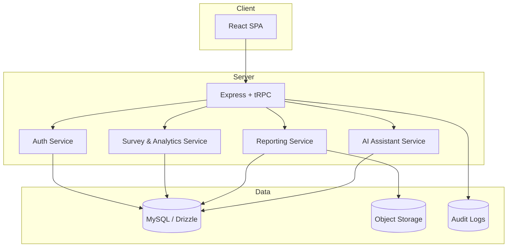
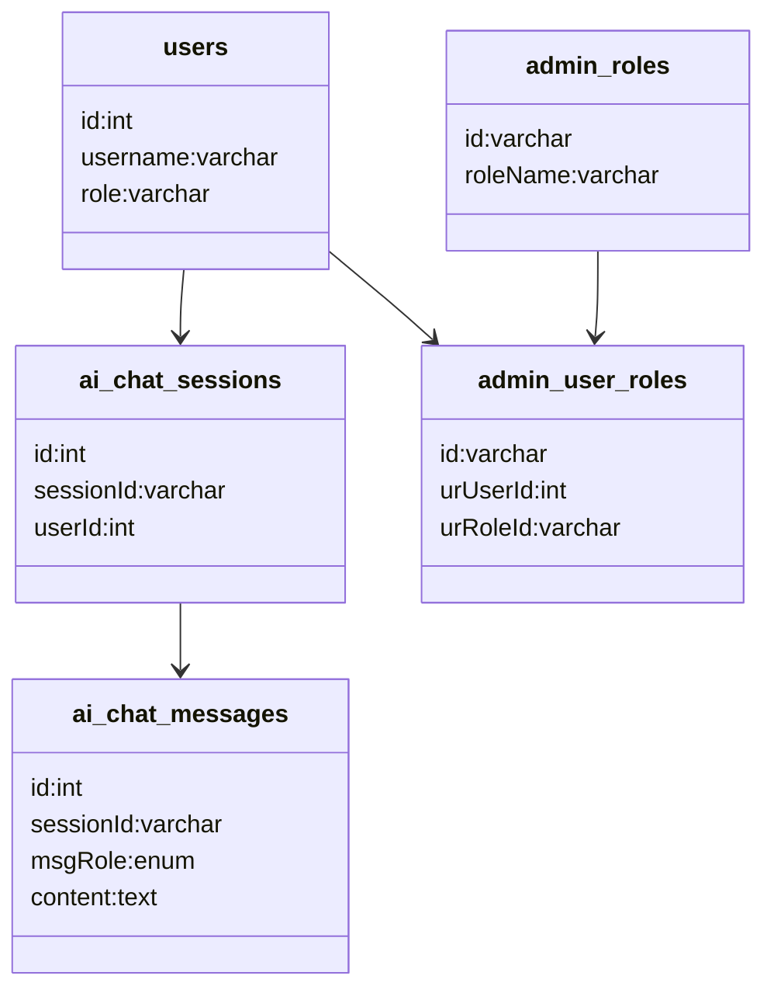

# rasid - docs-core

> Auto-extracted source code documentation

---

## `docs/core/ARCHITECTURE_DIAGRAM.md`

```markdown
# Architecture Diagram



```

---

## `docs/core/DATABASE_SCHEMA.md`

```markdown
# Database Schema

## الجداول الأساسية (منطقياً)
- `users`: بيانات المستخدمين والأدوار.
- `activity_logs`: سجل العمليات.
- `admin_*`: جداول الإدارة والصلاحيات.
- `ai_chat_sessions` و`ai_chat_messages`: جلسات ورسائل المساعد الذكي.

## علاقات رئيسية
- المستخدم يمتلك جلسات AI متعددة.
- كل جلسة AI تحتوي رسائل متعددة.
- المستخدم يمكن أن يرتبط بعدة أدوار عبر جدول وسيط.

## مخطط مبسط


```

---

## `docs/core/LEAKAGE_MONITORING_PLATFORM_STRUCTURE.md`

```markdown
# الهيكل الوظيفي - منصة رصد حالات التسريب

## 1) الهدف
منصة رصد التسريب مختصة باكتشاف، تصنيف، ومتابعة حالات تسريب البيانات والمعلومات الحساسة عبر القنوات الرقمية.

## 2) الهيكل المعلوماتي (Information Architecture)
- **لوحة الرصد اللحظي:** حالات جديدة، حرجة، قيد المعالجة.
- **إدارة الحالات (Cases):** فتح/تحديث/تصعيد/إغلاق الحالة.
- **الأدلة الرقمية (Evidence):** ملفات، صور، روابط، لقطات شاشة، بصمات رقمية.
- **مصادر الرصد (Sources):** ويب مفتوح، منصات اجتماعية، قنوات أخرى.
- **التحليل والتصنيف:** تصنيف نوع التسريب (PII، مالي، تشغيلي...).
- **الاستجابة والمعالجة:** خطوات الاحتواء والتصعيد والتوثيق.
- **التقارير التنفيذية:** اتجاهات، أسباب جذرية، وقياس زمن الاستجابة.

## 3) الهيكل التقني (Logical Modules)
1. **Ingestion Service**
   - إدخال البيانات من المصادر أو رفع يدوي.
2. **Detection & Classification Engine**
   - اكتشاف أنماط التسريب وتحديد الحساسية.
3. **Case Management Service**
   - إدارة دورة حياة الحالة ومهام الفرق.
4. **Evidence Vault Service**
   - حفظ الأدلة وربطها بكل حالة مع سلسلة حفظ (Chain of Custody).
5. **Notification & Escalation Service**
   - تنبيهات تلقائية وتصعيد وفق SLA.
6. **Reporting Service**
   - مؤشرات التشغيل والتقارير الدورية.

## 4) نموذج الصلاحيات
- **SOC Lead / قائد الرصد:** إدارة كاملة للحالات الحرجة.
- **Analyst:** تحليل وتصنيف ومتابعة الحالات.
- **Responder:** تنفيذ إجراءات الاحتواء والمعالجة.
- **Executive Viewer:** عرض مؤشرات الأداء فقط.

## 5) تدفقات رئيسية
- اكتشاف إشارة تسريب ← فتح حالة تلقائياً.
- إرفاق الأدلة وتقييم الخطورة.
- تعيين الحالة لفريق الاستجابة مع SLA.
- إغلاق الحالة بعد التحقق وتوثيق الدروس المستفادة.

```

---

## `docs/core/PLATFORM_PAGE_FUNCTIONS_MATRIX.md`

```markdown
# مصفوفة وظائف الصفحات - منصة الخصوصية ومنصة رصد التسريب

## A) منصة الخصوصية

| الصفحة | الوظائف الأساسية |
|---|---|
| Dashboard الخصوصية | عرض KPIs الامتثال، تنبيهات، توزيع الحالات، نسب الإنجاز، فلاتر زمنية/جهوية |
| سجل المعالجات (RoPA) | إنشاء سجل معالجة، تعديل، أرشفة، ربط الأساس النظامي، استعراض تاريخ التغيير |
| إدارة الموافقات | تسجيل الموافقة، تحديثها، سحبها، إثبات المصدر/الوقت/القناة، البحث والتصفية |
| طلبات أصحاب البيانات (DSR) | استقبال الطلب، تحقق الهوية، تعيين المسؤول، متابعة SLA، تنفيذ الإجراء، إغلاق مع توثيق |
| تقييم الأثر (DPIA) | إنشاء تقييم جديد، نموذج مخاطر، احتساب درجة الخطورة، اعتماد التوصيات |
| الحوادث والبلاغات | تسجيل حادث، تصنيف الشدة، تعيين فريق، متابعة إجراءات الاحتواء، تصعيد تلقائي |
| السياسات والتدقيق | نشر/تحديث سياسة، ربط أدلة الالتزام، تتبع نتائج المراجعة، إصدار تقرير تدقيق |
| التقارير | تصدير PDF/Excel، تقارير شهرية/ربع سنوية، مقارنة فترات، مشاركة آمنة |

## B) منصة رصد حالات التسريب

| الصفحة | الوظائف الأساسية |
|---|---|
| Dashboard الرصد | إجمالي الحالات، الحالات الحرجة، MTTA/MTTR، خريطة المصادر، مؤشرات فورية |
| قائمة الحالات | إنشاء حالة، تحديث الحالة، تغيير الأولوية، تعيين المحلل، تصعيد، إغلاق |
| تفاصيل الحالة | التسلسل الزمني، بيانات المتأثرين، الأثر، الإجراءات المتخذة، سجل القرارات |
| الأدلة الرقمية | رفع أدلة، ربط URL/لقطات، تصنيف الدليل، التحقق من السلامة، سلسلة الحفظ |
| مصادر الرصد | إضافة/تعطيل مصدر، إدارة إعدادات الجمع، مراقبة جودة المصدر |
| التحليل والتصنيف | تصنيف نوع التسريب، تحديد الحساسية، ربط الأنظمة المتأثرة، تقييم مخاطر |
| الاستجابة والمعالجة | إنشاء خطة احتواء، مهام الفريق، تتبع التنفيذ، توثيق المعالجة النهائية |
| التقارير التنفيذية | اتجاهات التسريب، أكثر القنوات خطورة، أداء الفرق، تصدير ومشاركة التقارير |

## C) وظائف مشتركة في كل منصة
- إدارة المستخدمين والأدوار والصلاحيات.
- سجل تدقيق كامل (Audit Trail) لكل عملية حساسة.
- البحث المتقدم والفلاتر وحفظ طرق العرض.
- التصدير (PDF/Excel) والطباعة.
- الإشعارات والتنبيهات (داخل النظام/بريد).

```

---

## `docs/core/PRIVACY_PLATFORM_STRUCTURE.md`

```markdown
# الهيكل الوظيفي - منصة الخصوصية

## 1) الهدف
منصة الخصوصية مخصصة لإدارة الامتثال، تتبع ممارسات حماية البيانات الشخصية، وقياس مستوى التوافق مع الضوابط التنظيمية.

## 2) الهيكل المعلوماتي (Information Architecture)
- **لوحة التحكم (Dashboard):** مؤشرات الامتثال، التنبيهات، ونسبة الإنجاز.
- **سجل المعالجات (RoPA):** توثيق أنشطة معالجة البيانات.
- **إدارة الموافقات (Consent):** جمع/تحديث/سحب الموافقة.
- **طلبات أصحاب البيانات (DSR):** طلبات الوصول، التصحيح، الحذف، النقل.
- **تقييم الأثر (DPIA):** تقييم المخاطر قبل المعالجات الحساسة.
- **الحوادث والبلاغات:** إدارة حوادث الخصوصية والإخطار.
- **السياسات والتدقيق:** سياسات داخلية، مراجعات، وسجل أدلة.

## 3) الهيكل التقني (Logical Modules)
1. **Policy & Compliance Service**
   - إدارة الأطر التنظيمية والضوابط.
2. **Consent Service**
   - تخزين إثبات الموافقات وربطها بالعميل/القناة.
3. **DSR Workflow Service**
   - محرك دورة حياة الطلب (استلام ← تحقق ← تنفيذ ← إغلاق).
4. **Incident Response Service**
   - إدارة التصنيف، الشدة، وSLA الحوادث.
5. **Reporting & Audit Service**
   - تقارير امتثال دورية وتتبّع كامل للتغييرات.

## 4) نموذج الصلاحيات
- **DPO / مسؤول الخصوصية:** صلاحية كاملة على الامتثال والتقارير.
- **Compliance Analyst:** مراجعة الضوابط والطلبات.
- **Case Agent:** تنفيذ طلبات DSR والحوادث.
- **Viewer / Executive:** عرض مؤشرات وتقارير دون تعديل.

## 5) تدفقات رئيسية
- تسجيل نشاط معالجة جديد وربطه بالأساس النظامي.
- فتح طلب DSR وتتبعه حتى الإغلاق.
- تسجيل حادث خصوصية، تقييم شدته، وتفعيل خطة المعالجة.
- إصدار تقرير امتثال شهري قابل للتصدير.

```

---

