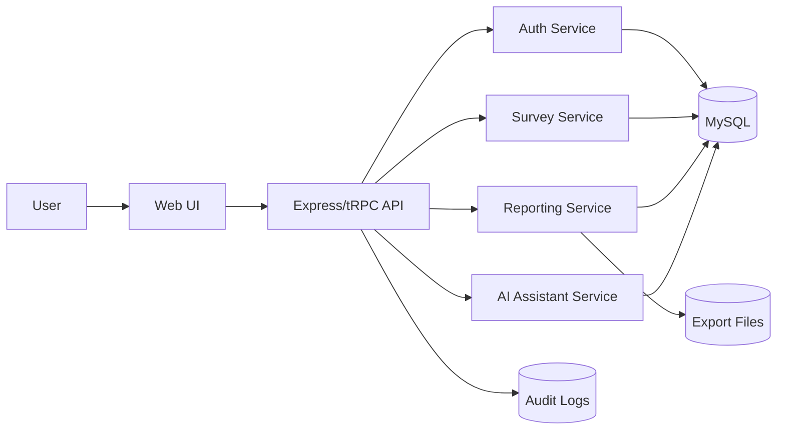
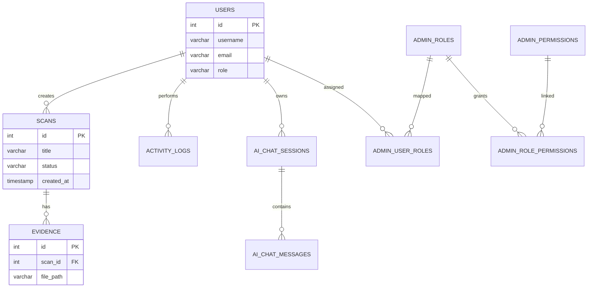

# rasid - docs-design

> Auto-extracted source code documentation

---

## `docs/design/DFD.md`

```markdown
# DFD - Data Flow Diagram



```

---

## `docs/design/ERD.md`

```markdown
# ERD - Entity Relationship Diagram



> ملاحظة: `SCANS` و`EVIDENCE` تمثلان نموذج الأعمال التشغيلي حتى لو كان التنفيذ الفعلي موزعاً على جداول متعددة.

```

---

## `docs/design/HLD.md`

```markdown
# HLD - High-Level Design

## مكونات المنظومة
1. **Client App**: واجهة المستخدم ولوحات المؤشرات.
2. **API Gateway / Server**: نقطة دخول الخدمات.
3. **Business Services**: إدارة المسوحات، المستخدمين، الذكاء.
4. **Database**: تخزين البيانات التشغيلية والتحليلية.
5. **Reporting Engine**: إنشاء ملفات PDF/Excel.

## تدفق العمل العام
المستخدم ⇢ الواجهة ⇢ API ⇢ الخدمات ⇢ قاعدة البيانات ⇢ استجابة ⇢ عرض وتصدير.

## المتطلبات التشغيلية
- مراقبة logs.
- نسخ احتياطي دوري.
- فصل بيئات dev/staging/prod.

```

---

## `docs/design/LLD.md`

```markdown
# LLD - Low-Level Design

## 1. وحدات Frontend
- `components/`: مكونات العرض.
- `pages/`: صفحات التطبيق.
- `lib/`: أدوات مشتركة (تصدير، تنسيق، صلاحيات).
- `contexts/`: إدارة الحالة المشتركة.

## 2. وحدات Backend
- `server/_core/index.ts`: نقطة تشغيل الخادم.
- `server/`: مسارات API، مساعد SSE، أدوات التصدير.
- `drizzle/schema.ts`: تعريف الجداول.

## 3. مثال تسلسل عملية
**إنشاء مسح جديد**
1. المستخدم يرسل نموذج إنشاء مسح.
2. API يتحقق من الصلاحية.
3. خدمة الأعمال تحفظ البيانات.
4. event log يسجل العملية.
5. الواجهة تحدّث القائمة.

```

---

## `docs/design/SDD.md`

```markdown
# SDD - Software Design Document

## 1. النمط المعماري
- Frontend: SPA باستخدام React + Vite.
- Backend: طبقة API (Express + tRPC) مع خدمات أعمال.
- Data: MySQL عبر Drizzle ORM + migration scripts.

## 2. مكونات رئيسية
- طبقة المصادقة والتفويض.
- طبقة إدارة المسوحات والأدلة.
- طبقة التحليلات والتقارير.
- طبقة المساعد الذكي.
- طبقة التدقيق والسجلات.

## 3. تصميم الأمان
- JWT للجلسات.
- bcrypt لكلمات المرور.
- تدقيق العمليات الحساسة.

## 4. اعتبارات التصميم
- فصل واضح بين العرض ومنطق الأعمال.
- مكونات UI قابلة لإعادة الاستخدام.
- مسارات API قابلة للتوسع.

```

---

