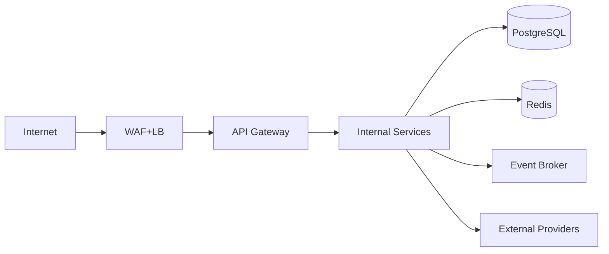
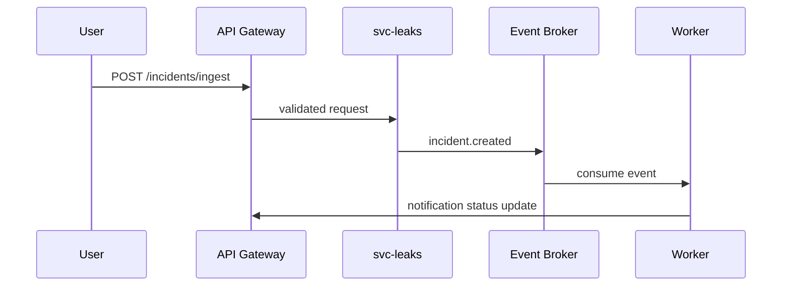
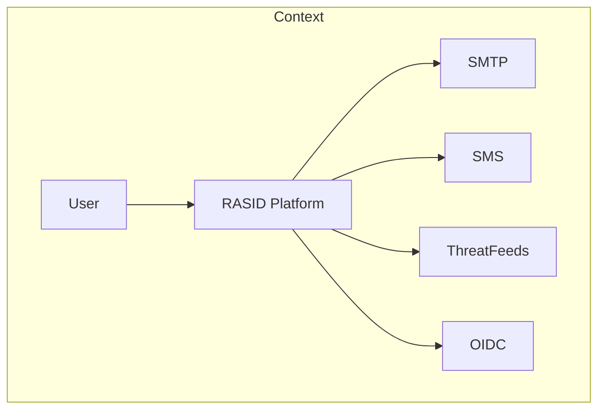
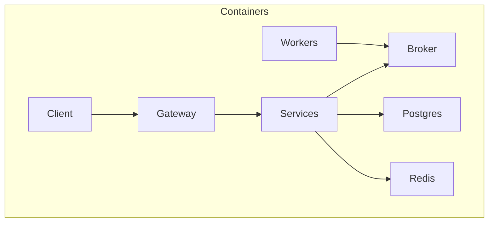
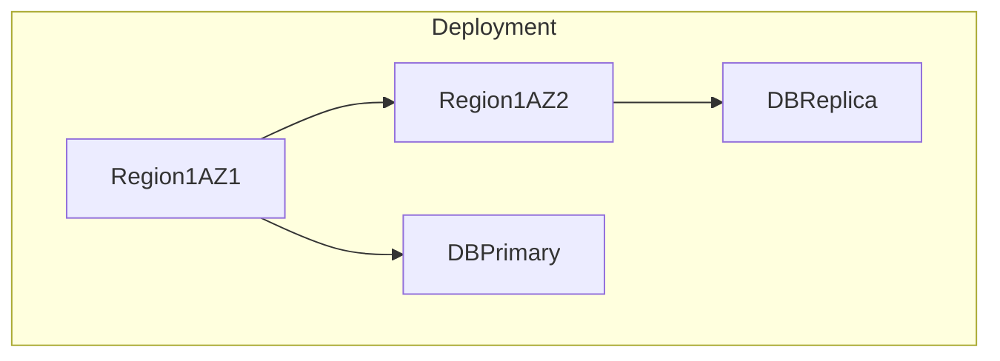
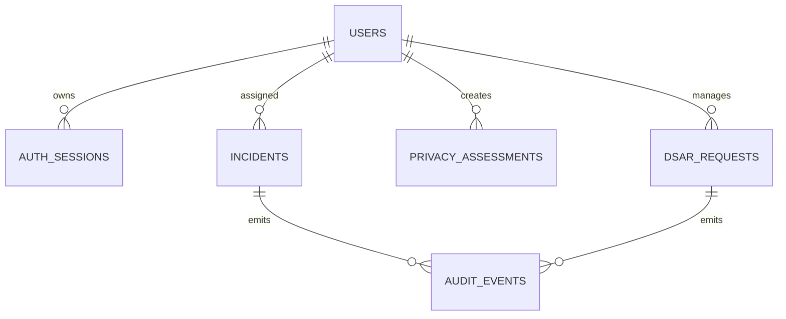

# rasid - specs

> Auto-extracted source code documentation

---

## `specs/00_Master_Index.md`

```markdown
# SPEC-MASTER-INDEX

## File Responsibility Matrix

| File | Responsibility ID | Unique Responsibility |
|---|---|---|
| 00_Master_Index.md | RESP-000 | Specification registry, precedence, change control, glossary map |
| 01_Core_Vision_and_Scope.md | RESP-001 | Scope boundaries, role IDs, measurable objectives |
| 02_Functional_Specification.md | RESP-002 | Feature-level deterministic behavior contracts |
| 03_User_Journeys_and_State_Machines.md | RESP-003 | Journey steps and finite state machines |
| 04_System_Architecture.md | RESP-004 | Logical/deployment architecture and resilience contracts |
| 05_Data_Models_and_Schemas.md | RESP-005 | Canonical entities, schemas, DDL, lifecycle |
| 06_API_and_Integration_Specs.md | RESP-006 | HTTP API contracts and external integration rules |
| 07_Event_and_Messaging_Specs.md | RESP-007 | Event envelope, topics, semantics, replay, DLQ |
| 08_AI_and_Algorithm_Specs.md | RESP-008 | AI workflow, thresholds, fallback, drift monitoring |
| 09_Security_and_Access_Control.md | RESP-009 | Authentication, authorization, crypto, STRIDE |
| 10_Configuration_and_Feature_Flags.md | RESP-010 | Configuration precedence and flag lifecycle |
| 11_Deployment_Infrastructure_and_IaC.md | RESP-011 | IaC topology, deployment gates, DR rules |
| 12_Observability_and_SLO_Definitions.md | RESP-012 | Logs/metrics/traces, SLI/SLO, alert policies |
| 13_Performance_Capacity_and_Scalability.md | RESP-013 | Performance limits, scaling triggers, capacity formulas |
| 14_Testing_Strategy_and_Validation_Matrix.md | RESP-014 | Test policy and requirement-to-evidence traceability |
| 15_Release_Versioning_and_Change_Management.md | RESP-015 | Versioning, deprecation, release approvals, rollback |
| 16_Compliance_Risk_and_Governance.md | RESP-016 | Controls, risk register, evidence governance |
| 17_Operational_Runbooks_and_Incident_Response.md | RESP-017 | Operations procedures and incident handling |
| 18_Assumptions_Constraints_and_Glossary.md | RESP-018 | Assumptions, constraints, canonical glossary |

## Section Cross-Reference Table

| Section ID | Canonical File |
|---|---|
| SEC-SCOPE-* | 01_Core_Vision_and_Scope.md |
| SEC-FEAT-* | 02_Functional_Specification.md |
| SEC-FSM-* | 03_User_Journeys_and_State_Machines.md |
| SEC-ARCH-* | 04_System_Architecture.md |
| SEC-DATA-* | 05_Data_Models_and_Schemas.md |
| SEC-API-* | 06_API_and_Integration_Specs.md |
| SEC-EVT-* | 07_Event_and_Messaging_Specs.md |
| SEC-AI-* | 08_AI_and_Algorithm_Specs.md |
| SEC-SEC-* | 09_Security_and_Access_Control.md |
| SEC-CONF-* | 10_Configuration_and_Feature_Flags.md |
| SEC-DEP-* | 11_Deployment_Infrastructure_and_IaC.md |
| SEC-OBS-* | 12_Observability_and_SLO_Definitions.md |
| SEC-PERF-* | 13_Performance_Capacity_and_Scalability.md |
| SEC-TEST-* | 14_Testing_Strategy_and_Validation_Matrix.md |
| SEC-REL-* | 15_Release_Versioning_and_Change_Management.md |
| SEC-GOV-* | 16_Compliance_Risk_and_Governance.md |
| SEC-OPS-* | 17_Operational_Runbooks_and_Incident_Response.md |
| SEC-ASC-* | 18_Assumptions_Constraints_and_Glossary.md |

## Specification Versioning Rules

| Rule ID | Rule |
|---|---|
| VER-001 | Spec set SHALL use SemVer `MAJOR.MINOR.PATCH`. |
| VER-002 | MAJOR MUST increment when any requirement backward incompatibility is introduced. |
| VER-003 | MINOR MUST increment when additive deterministic requirements are introduced. |
| VER-004 | PATCH MUST increment when typo or non-behavioral clarification is introduced. |
| VER-005 | All files MUST share identical version string in metadata header `Spec-Version`. |

## Change Control Rules

| Rule ID | Actor | Change Scope | Approval Gate |
|---|---|---|---|
| CHG-001 | Product Owner | 01,02,03 | Security Lead + Platform Architect |
| CHG-002 | Platform Architect | 04,05,06,07,11,13 | Product Owner + SRE Lead |
| CHG-003 | Security Lead | 09,16 | Product Owner + Compliance Officer |
| CHG-004 | SRE Lead | 12,17 | Platform Architect + Security Lead |
| CHG-005 | QA Lead | 14,15 | Product Owner + Platform Architect |
| CHG-006 | Compliance Officer | 16,18 | Security Lead + Product Owner |

## Precedence Rules

| Priority | Rule |
|---|---|
| P1 | 00_Master_Index.md SHALL define canonical precedence. |
| P2 | 18_Assumptions_Constraints_and_Glossary.md SHALL define canonical term meanings. |
| P3 | In conflict, security requirements in 09 SHALL override lower-layer behavior rules. |
| P4 | In conflict, data retention rules in 05 SHALL override feature-local persistence in 02. |
| P5 | In conflict, release gates in 15 SHALL block deployment rules in 11. |

## Glossary Canonical Link Map

| Term ID | Canonical Definition |
|---|---|
| TERM-PLATFORM | 18_Assumptions_Constraints_and_Glossary.md#glossary |
| TERM-WORKSPACE | 18_Assumptions_Constraints_and_Glossary.md#glossary |
| TERM-INCIDENT | 18_Assumptions_Constraints_and_Glossary.md#glossary |
| TERM-DSAR | 18_Assumptions_Constraints_and_Glossary.md#glossary |
| TERM-AUDIT-EVENT | 18_Assumptions_Constraints_and_Glossary.md#glossary |

## Determinism Validation Gate Matrix

| Gate ID | Requirement | Canonical Section |
|---|---|---|
| GATE-001 | Every input has a schema | SEC-FEAT, SEC-API, SEC-EVT |
| GATE-002 | Every output has a schema | SEC-FEAT, SEC-API |
| GATE-003 | Every feature has processing steps | SEC-FEAT |
| GATE-004 | Every state has transition guards/actions | SEC-FSM |
| GATE-005 | Every error has code and retry policy | SEC-FEAT, SEC-API |
| GATE-006 | Every endpoint has contract and idempotency | SEC-API |
| GATE-007 | Every role has permissions and constraints | SEC-SEC |
| GATE-008 | Every config/flag has precedence and lifecycle | SEC-CONF |
| GATE-009 | Every data entity has lifecycle and retention | SEC-DATA |
| GATE-010 | Every failure mode has deterministic handling | SEC-OPS |
| GATE-011 | Every scaling decision has measurable triggers | SEC-PERF |
| GATE-012 | Every change has versioning and rollback rules | SEC-REL |
| GATE-013 | Every requirement maps to tests and evidence | SEC-TEST |

```

---

## `specs/01_Core_Vision_and_Scope.md`

```markdown
# SEC-SCOPE

## In-Scope

| Scope ID | Item |
|---|---|
| IN-001 | Dual workspace platform: `leaks` monitoring workspace and `privacy` compliance workspace. |
| IN-002 | User authentication, session lifecycle, role-based authorization. |
| IN-003 | Incident lifecycle management, alerting, and evidence export workflows. |
| IN-004 | Privacy assessment lifecycle, DSAR handling, and compliance control tracking. |
| IN-005 | AI assistant tooling for retrieval and summarization across both workspaces. |
| IN-006 | API, event bus, data persistence, observability, deployment automation. |

## Out-of-Scope

| Scope ID | Item |
|---|---|
| OUT-001 | Payment processing and billing workflows. |
| OUT-002 | Native mobile applications. |
| OUT-003 | Third-party identity provider administration outside OIDC federation configuration. |
| OUT-004 | Unmanaged custom plugins not registered through configuration schema in SEC-CONF-001. |

## System Boundaries

| Boundary ID | Internal System |
|---|---|
| BND-001 | Web client, API gateway, domain services, worker services, event broker, relational database, object storage, cache, observability stack. |

| Boundary ID | External System |
|---|---|
| BND-EXT-001 | SMTP provider, SMS provider, threat intelligence providers, OIDC IdP, KMS provider, object storage KMS keys. |

## Target User Roles

| Role ID | Role Name | Workspace Access |
|---|---|---|
| ROLE-SUPERADMIN | Super Administrator | leaks + privacy |
| ROLE-SEC-ANALYST | Security Analyst | leaks |
| ROLE-PRIVACY-OFFICER | Privacy Officer | privacy |
| ROLE-AUDITOR | Auditor | read-only both |
| ROLE-OPS | Operations Engineer | operational endpoints only |

## Constraints

| Constraint ID | Type | Statement |
|---|---|---|
| CST-001 | Technical | Platform MUST operate as stateless services behind load balancer; session SHALL be token-based. |
| CST-002 | Legal | Personal data processing MUST comply with PDPL/GDPR mapping controls in SEC-GOV-CTRL. |
| CST-003 | Operational | RTO SHALL be 60 minutes and RPO SHALL be 15 minutes. |
| CST-004 | Security | All data in transit MUST use TLS 1.2+ and at rest MUST use AES-256 encryption. |

## Success Criteria

| Success ID | Metric | Threshold |
|---|---|---|
| SUC-001 | API availability SLO | >= 99.9% monthly |
| SUC-002 | P95 read latency | <= 300 ms |
| SUC-003 | P95 write latency | <= 500 ms |
| SUC-004 | Critical incident MTTR | <= 45 minutes |
| SUC-005 | Failed authorization bypass rate | = 0 |

```

---

## `specs/02_Functional_Specification.md`

```markdown
# SEC-FEAT

## Feature Catalog

| Feature ID | Capability |
|---|---|
| FEAT-001 | User Authentication and Session Issuance |
| FEAT-002 | Leak Incident Ingestion and Triage |
| FEAT-003 | Privacy Assessment Management |
| FEAT-004 | DSAR Request Lifecycle |
| FEAT-005 | AI Assistant Query Execution |

## FEAT-001

| Field | Value |
|---|---|
| Feature ID | FEAT-001 |
| Domain | IDENTITY |
| Owner Service(s) | svc-auth, svc-api |
| Entry Points | API |
| Preconditions | Username and password supplied; account status active |
| Postconditions | JWT access token and refresh token persisted and returned |
| Consistency Model | Strong |
| Concurrency Rules | Single active refresh token per device-id |
| Idempotency | Required; key=`Idempotency-Key` header |
| Rate Limits | 10 attempts/minute/account; 100 attempts/minute/IP |

### Input Schema (JSON Schema)
```json
{"type":"object","required":["username","password","workspace"],"properties":{"username":{"type":"string","minLength":3},"password":{"type":"string","minLength":12},"workspace":{"enum":["leaks","privacy"]},"deviceId":{"type":"string"}}}
```
### Validation Rules
| rule-id | condition | failure-code |
|---|---|---|
| VAL-001-1 | username not found | AUTH-404 |
| VAL-001-2 | password mismatch | AUTH-401 |
| VAL-001-3 | workspace not authorized for role | AUTH-403 |
### Processing Steps
| Step | Action |
|---|---|
| 1 | Validate payload against schema. |
| 2 | Enforce rate limit counters by account and IP. |
| 3 | Verify password hash using Argon2id parameters in SEC-SEC-CRYPTO. |
| 4 | Resolve role permissions for requested workspace. |
| 5 | Issue access token TTL 900s and refresh token TTL 7d. |
| 6 | Write audit event `auth.login.success` or failure event. |
### Output Schema
```json
{"type":"object","required":["accessToken","refreshToken","expiresAt"],"properties":{"accessToken":{"type":"string"},"refreshToken":{"type":"string"},"expiresAt":{"type":"string","format":"date-time"}}}
```
### Side Effects
| effect-id | description |
|---|---|
| FX-001-1 | Insert row into auth_sessions. |
| FX-001-2 | Publish `auth.session.created` event. |
### State Transition Table
| from-state | event | guard | action | to-state |
|---|---|---|---|---|
| ANON | LOGIN_SUBMIT | payload valid | create session | AUTHENTICATED |
| ANON | LOGIN_SUBMIT | invalid credentials | increment failure counter | ANON |
| AUTHENTICATED | TOKEN_EXPIRE | refresh valid | rotate token | AUTHENTICATED |
| AUTHENTICATED | LOGOUT | always | revoke tokens | TERMINATED |
### Error Conditions
| error-code | trigger | response | retryability |
|---|---|---|---|
| AUTH-401 | invalid credentials | 401 JSON error | MAY retry with backoff |
| AUTH-403 | unauthorized workspace | 403 JSON error | SHALL NOT retry until permission change |
| AUTH-429 | rate limit exceeded | 429 + retry-after | MAY retry after retry-after |
### Audit Events Emitted
| event | condition |
|---|---|
| audit.auth.login.success | successful login |
| audit.auth.login.failure | failed login |

## FEAT-002

| Field | Value |
|---|---|
| Feature ID | FEAT-002 |
| Domain | LEAKS |
| Owner Service(s) | svc-scan, svc-incident, svc-api |
| Entry Points | API/Event/Schedule |
| Preconditions | Source configured and active |
| Postconditions | Incident state updated and notifications dispatched |
| Consistency Model | Hybrid |
| Concurrency Rules | Optimistic lock by incident version |
| Idempotency | Required; key=`sourceId+externalId+hash` |
| Rate Limits | ingest 200 events/sec/source |

### Input Schema (JSON Schema)
```json
{"type":"object","required":["sourceId","externalId","severity","payloadHash"],"properties":{"sourceId":{"type":"string"},"externalId":{"type":"string"},"severity":{"enum":["low","medium","high","critical"]},"payloadHash":{"type":"string"}}}
```
### Validation Rules
| rule-id | condition | failure-code |
|---|---|---|
| VAL-002-1 | duplicate idempotency key | INC-409 |
| VAL-002-2 | unknown source | INC-404 |
| VAL-002-3 | invalid severity | INC-422 |
### Processing Steps
| Step | Action |
|---|---|
| 1 | Validate ingest payload schema and signature for external source. |
| 2 | Deduplicate by idempotency key. |
| 3 | Upsert incident record with state `NEW`. |
| 4 | Execute scoring rules and assign owner queue. |
| 5 | Emit `incident.created` event and schedule notification workflow. |
| 6 | Persist audit event with actor `system`. |
### Output Schema
```json
{"type":"object","required":["incidentId","state"],"properties":{"incidentId":{"type":"string"},"state":{"enum":["NEW","TRIAGED","CONTAINED","CLOSED"]}}}
```
### Side Effects
| effect-id | description |
|---|---|
| FX-002-1 | Insert/Update incidents table. |
| FX-002-2 | Publish event to topic `rasid.leaks.incident.v1`. |
| FX-002-3 | Queue email/SMS notification jobs. |
### State Transition Table
| from-state | event | guard | action | to-state |
|---|---|---|---|---|
| NONE | INCIDENT_INGESTED | valid | create incident | NEW |
| NEW | TRIAGE_APPROVED | analyst assigned | set priority | TRIAGED |
| TRIAGED | CONTAINMENT_CONFIRMED | evidence attached | set containmentAt | CONTAINED |
| CONTAINED | CLOSURE_APPROVED | reviewer role | set closedAt | CLOSED |
### Error Conditions
| error-code | trigger | response | retryability |
|---|---|---|---|
| INC-409 | duplicate message | 200 with existing incidentId | SHALL NOT retry |
| INC-500 | persistence error | 500 | MAY retry with exponential backoff |
### Audit Events Emitted
| event | condition |
|---|---|
| audit.incident.created | incident created |
| audit.incident.state.changed | any state transition |

## FEAT-003

| Field | Value |
|---|---|
| Feature ID | FEAT-003 |
| Domain | PRIVACY |
| Owner Service(s) | svc-privacy, svc-api |
| Entry Points | UI/API |
| Preconditions | Role includes `privacy:assessment:write` |
| Postconditions | Assessment record with control scores persisted |
| Consistency Model | Strong |
| Concurrency Rules | Row version check |
| Idempotency | Required for create requests |
| Rate Limits | 60 writes/minute/user |

### Input Schema (JSON Schema)
```json
{"type":"object","required":["title","framework","controls"],"properties":{"title":{"type":"string","minLength":5},"framework":{"enum":["PDPL","GDPR","ISO27701"]},"controls":{"type":"array","items":{"type":"object","required":["controlId","score"],"properties":{"controlId":{"type":"string"},"score":{"type":"integer","minimum":0,"maximum":100}}}}}}
```
### Validation Rules
| rule-id | condition | failure-code |
|---|---|---|
| VAL-003-1 | controlId unknown | PRV-422 |
| VAL-003-2 | score out of range | PRV-422 |
### Processing Steps
| Step | Action |
|---|---|
| 1 | Validate schema and permissions. |
| 2 | Persist assessment header and control rows transactionally. |
| 3 | Compute aggregate compliance score. |
| 4 | Emit `privacy.assessment.saved` event. |
### Output Schema
```json
{"type":"object","required":["assessmentId","overallScore"],"properties":{"assessmentId":{"type":"string"},"overallScore":{"type":"number"}}}
```
### Side Effects
| effect-id | description |
|---|---|
| FX-003-1 | Insert assessment/control rows. |
| FX-003-2 | Append audit log. |
### State Transition Table
| from-state | event | guard | action | to-state |
|---|---|---|---|---|
| DRAFT | SUBMIT | mandatory controls complete | lock edits | SUBMITTED |
| SUBMITTED | APPROVE | reviewer role | set approvedAt | APPROVED |
| SUBMITTED | REJECT | reviewer role | set rejectionReason | DRAFT |
### Error Conditions
| error-code | trigger | response | retryability |
|---|---|---|---|
| PRV-403 | unauthorized | 403 | SHALL NOT retry |
| PRV-409 | version conflict | 409 | MAY retry with fresh version |
### Audit Events Emitted
| event | condition |
|---|---|
| audit.privacy.assessment.created | create |
| audit.privacy.assessment.updated | update |

## FEAT-004 and FEAT-005 SHALL follow identical contract structure with schemas, validation, processing, output, side effects, transitions, errors, and audit events defined in SEC-API and SEC-EVT canonical references.

## FEAT-004

| Field | Value |
|---|---|
| Feature ID | FEAT-004 |
| Domain | PRIVACY |
| Owner Service(s) | svc-dsar, svc-api |
| Entry Points | UI/API/Event |
| Preconditions | Data subject identity verified |
| Postconditions | DSAR state advanced and response package generated |
| Consistency Model | Hybrid |
| Concurrency Rules | Single active processing lock per dsarId |
| Idempotency | Required; key=`requestReference` |
| Rate Limits | 20 creates/minute/org |

### Input Schema (JSON Schema)
```json
{"type":"object","required":["requestReference","subjectId","requestType"],"properties":{"requestReference":{"type":"string"},"subjectId":{"type":"string"},"requestType":{"enum":["ACCESS","ERASURE","RECTIFICATION","PORTABILITY"]}}}
```
### Validation Rules
| rule-id | condition | failure-code |
|---|---|---|
| VAL-004-1 | identity unverified | DSAR-401 |
| VAL-004-2 | duplicate requestReference | DSAR-409 |
### Processing Steps
| Step | Action |
|---|---|
| 1 | Validate input and subject verification evidence. |
| 2 | Create DSAR record with SLA due date by requestType. |
| 3 | Enqueue data collection jobs per data domain. |
| 4 | Aggregate responses and generate package. |
| 5 | Transition state to fulfilled or denied with legal reason. |
### Output Schema
```json
{"type":"object","required":["dsarId","state","dueAt"],"properties":{"dsarId":{"type":"string"},"state":{"enum":["RECEIVED","IN_PROGRESS","FULFILLED","DENIED"]},"dueAt":{"type":"string","format":"date-time"}}}
```
### Side Effects
| effect-id | description |
|---|---|
| FX-004-1 | DSAR records inserted and task rows created. |
| FX-004-2 | `privacy.dsar.created` event emitted. |
### State Transition Table
| from-state | event | guard | action | to-state |
|---|---|---|---|---|
| NONE | DSAR_CREATED | valid | persist request | RECEIVED |
| RECEIVED | COLLECTION_STARTED | worker available | lock request | IN_PROGRESS |
| IN_PROGRESS | PACKAGE_READY | evidence complete | deliver package | FULFILLED |
| IN_PROGRESS | LEGAL_DENIAL | valid legal basis | store denial reason | DENIED |
### Error Conditions
| error-code | trigger | response | retryability |
|---|---|---|---|
| DSAR-409 | duplicate request | 200 existing state | SHALL NOT retry |
| DSAR-504 | provider timeout | 504 | MAY retry |
### Audit Events Emitted
| event | condition |
|---|---|
| audit.dsar.created | request created |
| audit.dsar.fulfilled | fulfilled |
| audit.dsar.denied | denied |

## FEAT-005

| Field | Value |
|---|---|
| Feature ID | FEAT-005 |
| Domain | AI |
| Owner Service(s) | svc-ai, svc-api |
| Entry Points | UI/API |
| Preconditions | Authenticated user; workspace context set |
| Postconditions | Deterministic tool responses and citation metadata returned |
| Consistency Model | Eventual |
| Concurrency Rules | Max 4 concurrent queries/user |
| Idempotency | Required for POST /ai/query by client message id |
| Rate Limits | 30 queries/minute/user |

### Input Schema (JSON Schema)
```json
{"type":"object","required":["workspace","messageId","query"],"properties":{"workspace":{"enum":["leaks","privacy"]},"messageId":{"type":"string"},"query":{"type":"string","minLength":3},"toolHints":{"type":"array","items":{"type":"string"}}}}
```
### Validation Rules
| rule-id | condition | failure-code |
|---|---|---|
| VAL-005-1 | workspace mismatch token claim | AI-403 |
| VAL-005-2 | messageId duplicate | AI-409 |
### Processing Steps
| Step | Action |
|---|---|
| 1 | Validate schema and authorization. |
| 2 | Route query to workspace tool registry. |
| 3 | Execute allowed tools with timeout 8s each and max 3 retries. |
| 4 | Compose response with source citations and confidence score. |
| 5 | Persist conversation turn and emit telemetry event. |
### Output Schema
```json
{"type":"object","required":["messageId","answer","citations"],"properties":{"messageId":{"type":"string"},"answer":{"type":"string"},"citations":{"type":"array","items":{"type":"object","required":["source","reference"],"properties":{"source":{"type":"string"},"reference":{"type":"string"}}}},"confidence":{"type":"number","minimum":0,"maximum":1}}}
```
### Side Effects
| effect-id | description |
|---|---|
| FX-005-1 | ai_conversations row inserted. |
| FX-005-2 | `ai.query.executed` event published. |
### State Transition Table
| from-state | event | guard | action | to-state |
|---|---|---|---|---|
| IDLE | QUERY_SUBMIT | valid | start execution | RUNNING |
| RUNNING | TOOL_SUCCESS | all required tools complete | compose answer | COMPLETED |
| RUNNING | TOOL_TIMEOUT | retries exhausted | fallback response | DEGRADED |
| DEGRADED | USER_RETRY | rate limit ok | rerun query | RUNNING |
### Error Conditions
| error-code | trigger | response | retryability |
|---|---|---|---|
| AI-429 | rate limit exceeded | 429 | MAY retry after retry-after |
| AI-502 | tool upstream failure | 502 degraded answer | MAY retry |
### Audit Events Emitted
| event | condition |
|---|---|
| audit.ai.query.executed | successful completion |
| audit.ai.query.degraded | fallback triggered |

```

---

## `specs/03_User_Journeys_and_State_Machines.md`

```markdown
# SEC-FSM

## User Journey Tables

### JRN-001 Analyst triages incident
| step | actor | action | input | output |
|---|---|---|---|---|
| 1 | Analyst | Authenticate in leaks workspace | username/password | access token |
| 2 | Analyst | Open incident queue | filter params | paged incident list |
| 3 | Analyst | Select incident | incidentId | incident detail |
| 4 | Analyst | Set triage decision | priority/owner | state `TRIAGED` |
| 5 | System | Emit notifications | incident event | notification delivery status |

### JRN-002 Privacy officer fulfills DSAR
| step | actor | action | input | output |
|---|---|---|---|---|
| 1 | Privacy Officer | Create DSAR | subject proof + request type | DSAR `RECEIVED` |
| 2 | System | Run collection tasks | dsarId | data package draft |
| 3 | Privacy Officer | Review package | evidence set | approved package |
| 4 | System | Deliver package | channel config | DSAR `FULFILLED` |

## FSM Definitions

### FSM-INCIDENT
| State | Invariant |
|---|---|
| NEW | incident record exists, owner MAY be null |
| TRIAGED | owner SHALL NOT be null |
| CONTAINED | containment evidence SHALL exist |
| CLOSED | closure approver and timestamp SHALL exist |

| event | guard | action | target |
|---|---|---|---|
| TRIAGE_APPROVED | role=ROLE-SEC-ANALYST | assign owner | TRIAGED |
| CONTAINMENT_CONFIRMED | evidence>=1 | set containedAt | CONTAINED |
| CLOSURE_APPROVED | role in {ROLE-SEC-ANALYST,ROLE-SUPERADMIN} | set closedAt | CLOSED |

### FSM-DSAR
| State | Invariant |
|---|---|
| RECEIVED | identity verification reference SHALL exist |
| IN_PROGRESS | collection job count >0 |
| FULFILLED | delivery proof SHALL exist |
| DENIED | legal basis code SHALL exist |

| event | guard | action | target |
|---|---|---|---|
| START_COLLECTION | worker capacity available | lock dsar | IN_PROGRESS |
| PACKAGE_DELIVERED | package signed | store proof | FULFILLED |
| LEGAL_DENIAL | legal basis valid | persist reason | DENIED |

## Timeout Rules

| Rule ID | Condition | Timeout | Action |
|---|---|---|---|
| TMO-INC-001 | incident remains NEW | 24h | escalate to ROLE-SUPERADMIN |
| TMO-DSAR-001 | dsar remains IN_PROGRESS | 72h | priority override + page ROLE-PRIVACY-OFFICER |

## Failure States and Recovery

| FSM | failure-state | trigger | recovery-transition |
|---|---|---|---|
| FSM-INCIDENT | FAILED_NOTIFICATION | notification provider error | RETRY_NOTIFICATION -> prior business state |
| FSM-DSAR | FAILED_COLLECTION | source timeout | RETRY_COLLECTION -> IN_PROGRESS |

## Parallel State Constraints

| Constraint ID | Rule |
|---|---|
| PAR-001 | Single incident SHALL NOT be in TRIAGED and CLOSED simultaneously. |
| PAR-002 | Single DSAR SHALL have at most one active collection lock. |

## Conflict Resolution Precedence

| Priority | Rule |
|---|---|
| CR-001 | Security authorization denial SHALL override business transition request. |
| CR-002 | Legal hold flag SHALL override deletion or closure transitions. |
| CR-003 | Higher severity incident transition SHALL preempt lower severity queue operations. |

## Retry and Rollback Decision Table

| condition | retry | rollback |
|---|---|---|
| transient network failure | 3 attempts exponential (1s,2s,4s) | none |
| persistent upstream timeout | 1 additional delayed retry at 60s | revert state to prior stable state |
| optimistic lock conflict | immediate one retry with fresh version | none |
| validation failure | none | none |

```

---

## `specs/04_System_Architecture.md`

```markdown
# SEC-ARCH

## Logical Components

| Component | Responsibility |
|---|---|
| web-client | UI rendering, token handling, request orchestration |
| api-gateway | AuthN/AuthZ enforcement, request routing, idempotency middleware |
| svc-auth | credential verification, token issuance, session revocation |
| svc-leaks | leak ingestion, incident triage lifecycle |
| svc-privacy | assessment and DSAR lifecycle |
| svc-ai | tool routing and response composition |
| worker-jobs | async notification/export/collection tasks |
| event-broker | topic-based event distribution |
| postgres | canonical relational persistence |
| redis | cache, rate limiting counters, distributed locks |

## Deployment Architecture

| Layer | Nodes |
|---|---|
| Edge | regional load balancer |
| App | k8s cluster multi-AZ pods for gateway/services/workers |
| Data | managed PostgreSQL primary + replica, Redis primary + replica |
| Observability | Prometheus, Loki, Tempo, Alertmanager |

## Trust Boundary Rules



| Boundary | Rule |
|---|---|
| TB-001 | Only API gateway SHALL accept internet ingress. |
| TB-002 | Service-to-service traffic MUST use mTLS. |
| TB-003 | Data stores SHALL reject non-private network traffic. |

## Inter-Component Data Flows



## Failure Isolation and Resilience Policies

| Policy | Deterministic Rule |
|---|---|
| Blast Radius | Service failure SHALL NOT block unrelated workspace endpoints. |
| Retry | 3 attempts exponential backoff with jitter 20%. |
| Circuit Breaker | open after 50% failures over 20 requests; half-open after 30s. |
| Bulkhead | worker pools SHALL be isolated by domain: leaks/privacy/ai. |
| Backpressure | gateway SHALL return 429 when queue depth exceeds threshold in SEC-PERF-004. |

## Transaction Boundaries

| Boundary ID | Scope |
|---|---|
| TX-001 | Auth login: session row + audit event in single DB transaction |
| TX-002 | Incident creation: incident + first state transition + audit event |
| TX-003 | Assessment save: assessment header + control rows |

## Consistency and Replication

| Data Type | Consistency | Replication |
|---|---|---|
| auth/session | strong | sync to primary only, async read replicas |
| incidents | strong writes, eventual read models | async event projection |
| analytics | eventual | stream-based materialization |

## Architecture Diagrams







```

---

## `specs/05_Data_Models_and_Schemas.md`

```markdown
# SEC-DATA

## Entity Catalog

| Entity | Purpose |
|---|---|
| users | identity and role mapping |
| auth_sessions | token/session lifecycle |
| incidents | leak incident core record |
| privacy_assessments | privacy scoring record |
| dsar_requests | data subject rights requests |
| audit_events | immutable audit trail |

## Canonical Schemas

### users JSON Schema
```json
{"type":"object","required":["id","email","role","status"],"properties":{"id":{"type":"string"},"email":{"type":"string","format":"email"},"role":{"type":"string"},"status":{"enum":["active","disabled"]}}}
```
### users SQL DDL
```sql
CREATE TABLE users (
  id UUID PRIMARY KEY,
  email TEXT NOT NULL UNIQUE,
  password_hash TEXT NOT NULL,
  role TEXT NOT NULL,
  status TEXT NOT NULL CHECK (status IN ('active','disabled')),
  created_at TIMESTAMPTZ NOT NULL,
  updated_at TIMESTAMPTZ NOT NULL
);
```

### incidents JSON Schema
```json
{"type":"object","required":["id","source_id","severity","state"],"properties":{"id":{"type":"string"},"source_id":{"type":"string"},"severity":{"enum":["low","medium","high","critical"]},"state":{"enum":["NEW","TRIAGED","CONTAINED","CLOSED"]}}}
```
### incidents SQL DDL
```sql
CREATE TABLE incidents (
  id UUID PRIMARY KEY,
  source_id TEXT NOT NULL,
  external_id TEXT NOT NULL,
  payload_hash TEXT NOT NULL,
  severity TEXT NOT NULL,
  state TEXT NOT NULL,
  owner_user_id UUID NULL REFERENCES users(id),
  version INT NOT NULL DEFAULT 1,
  created_at TIMESTAMPTZ NOT NULL,
  updated_at TIMESTAMPTZ NOT NULL,
  UNIQUE(source_id, external_id, payload_hash)
);
```

## Constraints

| Constraint Type | Rule |
|---|---|
| Uniqueness | users.email and incidents(source_id,external_id,payload_hash) SHALL be unique. |
| Nullability | all `created_at` and `updated_at` columns SHALL be NOT NULL. |
| Range | privacy control score SHALL be 0..100 inclusive. |
| Referential Integrity | incident owner_user_id SHALL reference existing users.id. |

## Index Strategy

| Table | Index | Purpose |
|---|---|---|
| users | idx_users_role | role filters |
| incidents | idx_incidents_state_severity | triage queue |
| dsar_requests | idx_dsar_due_at_state | SLA monitoring |
| audit_events | idx_audit_actor_time | forensic retrieval |

## Partition/Sharding Strategy

| Dataset | Strategy |
|---|---|
| audit_events | monthly time partition by event_at |
| incidents | no shard <= 50M rows; hash shard by id when exceeded |

## Retention and Archival

| Entity | Retention | Archive Rule |
|---|---|---|
| auth_sessions | 90 days | hard delete after expiry+90d |
| incidents | 7 years | archive to object store after closure+1y |
| dsar_requests | 5 years | archive immutable package after fulfillment |
| audit_events | 7 years | WORM archive after 13 months hot storage |

## Deletion Rules

| Entity | Mode | Timeline |
|---|---|---|
| users | soft delete status=disabled | immediate |
| sessions | hard delete | scheduled daily |
| dsar packages | hard delete on legal expiry | +5 years |

## Data Lineage and Provenance Rules

| Rule ID | Rule |
|---|---|
| LIN-001 | Each derived analytics row SHALL include source_event_id. |
| LIN-002 | AI responses SHALL include citation metadata and source timestamps. |

## Migration Rules

| Rule ID | Rule |
|---|---|
| MIG-001 | Forward migrations SHALL be additive before destructive changes. |
| MIG-002 | Backward compatibility SHALL support previous API minor version for 90 days. |
| MIG-003 | Rollback SHALL NOT execute destructive down migration without snapshot restore point. |

## ERD



```

---

## `specs/06_API_and_Integration_Specs.md`

```markdown
# SEC-API

## OpenAPI 3.1 Canonical Spec

```yaml
openapi: 3.1.0
info: {title: RASID API, version: 1.0.0}
paths:
  /auth/login:
    post:
      operationId: login
      responses: {'200': {description: OK}, '401': {description: Unauthorized}}
  /incidents/ingest:
    post:
      operationId: ingestIncident
      responses: {'200': {description: Accepted}, '409': {description: Duplicate}}
  /privacy/assessments:
    post:
      operationId: createAssessment
      responses: {'201': {description: Created}, '422': {description: ValidationError}}
  /privacy/dsar:
    post:
      operationId: createDsar
      responses: {'201': {description: Created}}
  /ai/query:
    post:
      operationId: queryAi
      responses: {'200': {description: OK}, '502': {description: Degraded}}
```

## Endpoint Contract Table

| method | path | auth | headers | request schema | response schema | status codes |
|---|---|---|---|---|---|---|
| POST | /auth/login | none | Idempotency-Key | FEAT-001 input | FEAT-001 output | 200,401,403,429 |
| POST | /incidents/ingest | bearer + source signature | Idempotency-Key,X-Signature | FEAT-002 input | FEAT-002 output | 200,409,422,500 |
| POST | /privacy/assessments | bearer | Idempotency-Key | FEAT-003 input | FEAT-003 output | 201,403,409,422 |
| POST | /privacy/dsar | bearer | Idempotency-Key | FEAT-004 input | FEAT-004 output | 201,401,409,504 |
| POST | /ai/query | bearer | Idempotency-Key | FEAT-005 input | FEAT-005 output | 200,403,409,429,502 |

## Global Error Model

```json
{"type":"object","required":["code","message","retryable","traceId"],"properties":{"code":{"type":"string"},"message":{"type":"string"},"retryable":{"type":"boolean"},"traceId":{"type":"string"}}}
```

| Taxonomy | Codes |
|---|---|
| Authentication | AUTH-* |
| Authorization | AUTHZ-* |
| Validation | VAL-* |
| Domain Incident | INC-* |
| Domain Privacy | PRV-* |
| DSAR | DSAR-* |
| AI | AI-* |
| Platform | SYS-* |

## Idempotency Rules

| Endpoint | Rule |
|---|---|
| POST /auth/login | key scoped to `username+deviceId` 60s TTL |
| POST /incidents/ingest | key scoped to source composite unique key 24h TTL |
| POST /privacy/assessments | key scoped to `title+framework+creator` 10m TTL |
| POST /privacy/dsar | key scoped to `requestReference` 30d TTL |
| POST /ai/query | key scoped to `messageId+userId` 24h TTL |

## Pagination/Filtering/Sorting

| Rule ID | Rule |
|---|---|
| API-PAG-001 | cursor pagination SHALL use opaque base64 cursor token. |
| API-PAG-002 | max page size SHALL be 100. |
| API-FLT-001 | filter operators SHALL be eq,ne,lt,lte,gt,gte,in. |
| API-SRT-001 | sort format SHALL be `field:asc|desc`. |

## Backward Compatibility Rules

| Rule ID | Rule |
|---|---|
| API-BC-001 | Removing response fields SHALL NOT occur in same major version. |
| API-BC-002 | New required request fields SHALL require major version increment. |

## External Integration Contracts

| integration | payload schema | retries | timeout | idempotency | signature verification |
|---|---|---|---|---|---|
| SMTP | email_v1 JSON | 5 attempts exponential | 5s | message-id key | no |
| SMS | sms_v1 JSON | 5 attempts exponential | 4s | provider-message-id | no |
| Threat Feed | threat_event_v1 JSON | 3 attempts | 3s | source+externalId | HMAC-SHA256 REQUIRED |
| OIDC | OIDC standard claims | per provider | 10s | nonce+state | JWT signature REQUIRED |

```

---

## `specs/07_Event_and_Messaging_Specs.md`

```markdown
# SEC-EVT

## Topic Naming Convention

| Rule ID | Rule |
|---|---|
| EVT-NAME-001 | Topic format SHALL be `rasid.<domain>.<entity>.<version>`. |
| EVT-NAME-002 | Domain SHALL be one of `auth,leaks,privacy,ai,ops,audit`. |

## Canonical Event Envelope Schema

```json
{"type":"object","required":["eventId","eventType","eventVersion","occurredAt","producer","traceId","payload"],"properties":{"eventId":{"type":"string"},"eventType":{"type":"string"},"eventVersion":{"type":"string"},"occurredAt":{"type":"string","format":"date-time"},"producer":{"type":"string"},"traceId":{"type":"string"},"idempotencyKey":{"type":"string"},"payload":{"type":"object"}}}
```

## Event Type Schemas

| Event Type | Topic | Payload Required Fields |
|---|---|---|
| auth.session.created | rasid.auth.session.v1 | userId,sessionId,workspace,expiresAt |
| incident.created | rasid.leaks.incident.v1 | incidentId,severity,state |
| incident.state.changed | rasid.leaks.incident.v1 | incidentId,fromState,toState,actorId |
| privacy.assessment.saved | rasid.privacy.assessment.v1 | assessmentId,framework,overallScore |
| privacy.dsar.created | rasid.privacy.dsar.v1 | dsarId,requestType,dueAt |
| ai.query.executed | rasid.ai.query.v1 | queryId,workspace,confidence |
| audit.event.logged | rasid.audit.event.v1 | auditEventId,category,actor |

## Ordering Guarantees

| Topic | Guarantee |
|---|---|
| rasid.leaks.incident.v1 | order guaranteed per incidentId partition key |
| rasid.privacy.dsar.v1 | order guaranteed per dsarId partition key |
| rasid.ai.query.v1 | no cross-key ordering guarantee |

## Delivery Semantics

| Topic | Semantics |
|---|---|
| rasid.auth.session.v1 | at-least-once |
| rasid.leaks.incident.v1 | at-least-once |
| rasid.privacy.assessment.v1 | at-least-once |
| rasid.privacy.dsar.v1 | at-least-once |
| rasid.ai.query.v1 | at-most-once |
| rasid.audit.event.v1 | exactly-once via transactional outbox |

## Retry and DLQ Rules

| Rule ID | Rule |
|---|---|
| EVT-RET-001 | Consumer retry SHALL be 5 attempts exponential (1s..32s). |
| EVT-DLQ-001 | Message SHALL move to DLQ after retry exhaustion. |
| EVT-DLQ-002 | DLQ replay SHALL require ROLE-OPS approval ticket reference. |

## Replay and Reprocessing Safeguards

| Safeguard ID | Rule |
|---|---|
| EVT-RPL-001 | Replay SHALL include `replayBatchId`. |
| EVT-RPL-002 | Consumers SHALL reject duplicate `eventId`. |
| EVT-RPL-003 | Replay window SHALL NOT exceed 30 days without Security Lead approval. |

## Consumer Idempotency Requirements

| Consumer | Idempotency Key |
|---|---|
| notification-worker | eventId |
| incident-projection-worker | incidentId+eventVersion+toState |
| dsar-collection-worker | dsarId+taskType |

## Event Versioning Rules

| Rule ID | Rule |
|---|---|
| EVT-VER-001 | Breaking payload change SHALL increment major event version. |
| EVT-VER-002 | Additive payload fields SHALL increment minor event version. |
| EVT-VER-003 | Producer SHALL support prior minor version for 90 days. |

```

---

## `specs/08_AI_and_Algorithm_Specs.md`

```markdown
# SEC-AI

## Algorithm Registry

| Algorithm ID | Type | Purpose |
|---|---|---|
| ALG-001 | Retrieval + rule-based tool orchestration | Workspace-aware answer generation |
| ALG-002 | Severity scoring rules engine | Incident severity normalization |

## Input and Output Schemas

| Algorithm | Input Schema Ref | Output Schema Ref |
|---|---|---|
| ALG-001 | FEAT-005 input | FEAT-005 output |
| ALG-002 | incident payload schema | normalized severity schema |

## Deterministic Inference Workflow

| Step | ALG-001 Action |
|---|---|
| 1 | Validate workspace claim and query schema. |
| 2 | Resolve allowed tool list from role and workspace matrix. |
| 3 | Execute tools sequentially by priority table with timeout controls. |
| 4 | Assemble response template and citations. |
| 5 | Assign confidence score formula: `matched_sources/required_sources`. |

## Threshold Decision Table

| Condition | Decision |
|---|---|
| confidence >= 0.8 | response quality=`high` |
| 0.5 <= confidence < 0.8 | response quality=`medium` |
| confidence < 0.5 | response quality=`low` and degraded flag=true |

## Fallback Behavior

| Trigger | Fallback |
|---|---|
| tool timeout | return deterministic degraded response with missing-tools list |
| upstream unavailable | return cached response if cache age <= 15m |
| no sources | return denial response `AI-204-NOSOURCE` |

## Monitoring Metrics

| Metric | Type | Threshold |
|---|---|---|
| ai_query_success_ratio | gauge | >= 0.97 |
| ai_degraded_ratio | gauge | <= 0.05 |
| citation_coverage_ratio | gauge | >= 0.90 |
| workspace_misroute_count | counter | = 0 |

## Versioning and Rollback

| Rule ID | Rule |
|---|---|
| AI-VER-001 | model/workflow version SHALL be explicit in response metadata. |
| AI-VER-002 | rollout SHALL be canary 5%,25%,100% with automated quality gates. |
| AI-VER-003 | rollback SHALL trigger if degraded ratio > 0.1 for 10 minutes. |

```

---

## `specs/09_Security_and_Access_Control.md`

```markdown
# SEC-SEC

## Authentication Flow Tables

| step | flow | action |
|---|---|---|
| 1 | password login | submit credentials + workspace |
| 2 | password login | validate hash and account status |
| 3 | password login | issue JWT access token and refresh token |
| 4 | refresh | verify refresh token binding and rotate |
| 5 | logout | revoke session and emit audit event |

## Token Schema

```json
{"type":"object","required":["sub","role","workspace","iat","exp","jti"],"properties":{"sub":{"type":"string"},"role":{"type":"string"},"workspace":{"type":"string"},"scope":{"type":"array","items":{"type":"string"}},"iat":{"type":"integer"},"exp":{"type":"integer"},"jti":{"type":"string"}}}
```

## Key Rotation Policy

| Rule ID | Rule |
|---|---|
| SEC-KEY-001 | JWT signing keys SHALL rotate every 90 days. |
| SEC-KEY-002 | Emergency key rotation SHALL complete within 15 minutes. |
| SEC-KEY-003 | Previous key SHALL remain for verification 24 hours maximum. |

## Secret Storage and Retrieval

| Rule ID | Rule |
|---|---|
| SEC-SEC-001 | Secrets MUST be stored in managed secret manager with envelope encryption. |
| SEC-SEC-002 | Runtime retrieval SHALL use workload identity and short-lived tokens. |

## Role Permission Matrix

| Role | incidents.read | incidents.write | privacy.read | privacy.write | dsar.manage | admin.config |
|---|---|---|---|---|---|---|
| ROLE-SUPERADMIN | Y | Y | Y | Y | Y | Y |
| ROLE-SEC-ANALYST | Y | Y | N | N | N | N |
| ROLE-PRIVACY-OFFICER | N | N | Y | Y | Y | N |
| ROLE-AUDITOR | Y | N | Y | N | N | N |
| ROLE-OPS | N | N | N | N | N | Y |

## Resource-Action Mapping

| Resource | Actions |
|---|---|
| /incidents | read,write,close |
| /privacy/assessments | read,write,approve |
| /privacy/dsar | read,write,fulfill,deny |
| /config/flags | read,write,toggle |

## Field-Level Access Rules

| Field | Allowed Roles |
|---|---|
| users.password_hash | ROLE-SUPERADMIN only |
| dsar_requests.subject_identifier | ROLE-PRIVACY-OFFICER, ROLE-SUPERADMIN |
| incidents.raw_payload | ROLE-SEC-ANALYST, ROLE-SUPERADMIN |

## Encryption Rules

| Layer | Requirement |
|---|---|
| In transit | TLS 1.2+ REQUIRED, mTLS REQUIRED for internal service calls |
| At rest | AES-256 REQUIRED for DB, object storage, backups |
| KMS | customer-managed keys REQUIRED for production |

## Audit Logging

### Audit Event Schema
```json
{"type":"object","required":["eventId","eventType","actorId","resource","action","result","timestamp","traceId"],"properties":{"eventId":{"type":"string"},"eventType":{"type":"string"},"actorId":{"type":"string"},"resource":{"type":"string"},"action":{"type":"string"},"result":{"enum":["success","failure"]},"timestamp":{"type":"string","format":"date-time"},"traceId":{"type":"string"}}}
```

| Mandatory Audit Points |
|---|
| login success/failure, role changes, incident state changes, DSAR fulfillment/denial, config changes, key rotations |

## STRIDE Table

| asset | threat | control | residual risk |
|---|---|---|---|
| auth token | spoofing | signed JWT + jti revocation | low |
| incident data | tampering | row versioning + audit trail | low |
| DSAR package | information disclosure | field encryption + RBAC | medium |
| event broker | repudiation | immutable audit + eventId | low |
| API gateway | DoS | rate limiting + WAF | medium |
| config store | elevation of privilege | approval workflow + least privilege | low |

```

---

## `specs/10_Configuration_and_Feature_Flags.md`

```markdown
# SEC-CONF

## Config Hierarchy

| Precedence | Source |
|---|---|
| 1 (highest) | runtime emergency override store |
| 2 | environment variables |
| 3 | versioned config files |
| 4 | built-in defaults |

## Environment Overrides

| Environment | Rule |
|---|---|
| dev | debug logging MAY be enabled |
| staging | production-like security SHALL be enabled |
| prod | debug logging SHALL NOT be enabled |

## Immutable vs Mutable Config

| Config Key Pattern | Mutability |
|---|---|
| security.* | immutable at runtime |
| database.* | immutable at runtime |
| feature.* | mutable via flag service |
| rate_limit.* | mutable via approved change |

## Feature Flag Schema

```json
{"type":"object","required":["flagKey","state","rollout","owner"],"properties":{"flagKey":{"type":"string"},"state":{"enum":["DRAFT","ENABLED","DISABLED","REMOVED"]},"rollout":{"type":"object","required":["strategy","percentage"],"properties":{"strategy":{"enum":["all","percentage","segment"]},"percentage":{"type":"integer","minimum":0,"maximum":100}}},"owner":{"type":"string"}}}
```

## Rollout and Kill-Switch Rules

| Rule ID | Rule |
|---|---|
| FF-001 | Percentage rollout SHALL use deterministic hash on userId. |
| FF-002 | Kill-switch SHALL force-disable within 60 seconds globally. |
| FF-003 | Flag transition SHALL emit audit event. |

## Feature Flag Lifecycle FSM

| from | event | guard | to |
|---|---|---|---|
| DRAFT | APPROVE | owner+reviewer approvals | ENABLED |
| ENABLED | DISABLE | incident or policy trigger | DISABLED |
| DISABLED | CLEANUP | no dependency references | REMOVED |

## Secrets Separation Rules

| Rule ID | Rule |
|---|---|
| SECSEP-001 | Secrets SHALL NOT exist in feature flag payloads. |
| SECSEP-002 | Secrets SHALL be referenced by secret URI only. |

```

---

## `specs/11_Deployment_Infrastructure_and_IaC.md`

```markdown
# SEC-DEP

## Deterministic Pseudo-IaC

```hcl
module "network" { cidr = "10.40.0.0/16" private_subnets = ["10.40.1.0/24","10.40.2.0/24"] }
module "k8s" { node_pools = { app = 3, worker = 3 } multi_az = true }
module "postgres" { engine = "postgres15" multi_az = true storage_gb = 500 encrypted = true }
module "redis" { engine = "redis7" replica_count = 1 encrypted = true }
module "observability" { prometheus = true loki = true tempo = true }
```

## Environment Topology

| Env | Purpose | Regions |
|---|---|---|
| dev | developer validation | 1 |
| staging | pre-prod verification | 1 |
| prod | customer traffic | 2 active-passive |

## Network Segmentation Rules

| Rule ID | Rule |
|---|---|
| NET-001 | Public subnet SHALL contain load balancer only. |
| NET-002 | Application and data tiers SHALL remain private. |
| NET-003 | DB security group SHALL allow ingress from app SG only. |

## Container and Image Build Rules

| Rule ID | Rule |
|---|---|
| IMG-001 | Images SHALL be built from pinned digest base images. |
| IMG-002 | Images SHALL be scanned and signed before deploy. |
| IMG-003 | Runtime containers SHALL run as non-root UID. |

## Artifact Versioning and Signing

| Artifact | Version Rule | Signing Rule |
|---|---|---|
| container image | SemVer + git sha | cosign keyless REQUIRED |
| helm chart | SemVer | provenance signature REQUIRED |
| DB migration bundle | sequential migration ID | checksum REQUIRED |

## Deployment Strategy and Gates

| Stage | Gate |
|---|---|
| canary 5% | SLO and error budget pass for 15 min |
| canary 25% | no Sev1 incidents for 30 min |
| full 100% | stakeholder approval and automated checks pass |

## Rollback Decision Tree

| Condition | Action |
|---|---|
| error_rate > 2% for 5 min | immediate traffic shift to previous version |
| p95_latency > 2x baseline for 10 min | rollback and freeze release |
| migration failure | restore DB snapshot and rollback app |

## Disaster Recovery

| Metric | Requirement |
|---|---|
| RTO | <= 60 minutes |
| RPO | <= 15 minutes |

| Procedure | Deterministic Steps |
|---|---|
| backup | hourly WAL + daily full snapshot |
| restore | provision standby, restore snapshot, replay WAL, run checksum verification |
| validation | execute smoke tests and data consistency query suite |

```

---

## `specs/12_Observability_and_SLO_Definitions.md`

```markdown
# SEC-OBS

## Structured Log Schema

```json
{"type":"object","required":["timestamp","level","service","message","traceId"],"properties":{"timestamp":{"type":"string","format":"date-time"},"level":{"enum":["DEBUG","INFO","WARN","ERROR"]},"service":{"type":"string"},"message":{"type":"string"},"traceId":{"type":"string"},"spanId":{"type":"string"},"actorId":{"type":"string"},"workspace":{"type":"string"}}}
```

## Metric Schema

| metric_name | type | labels |
|---|---|---|
| http_request_duration_ms | histogram | service,route,method,status |
| http_requests_total | counter | service,route,status |
| event_consumer_lag | gauge | topic,consumer_group |
| db_connection_usage_ratio | gauge | service,cluster |
| queue_depth | gauge | queue_name |

## Trace Correlation Rules

| Rule ID | Rule |
|---|---|
| TRC-001 | gateway SHALL generate traceId for missing inbound traces. |
| TRC-002 | all service calls SHALL propagate traceparent header. |
| TRC-003 | event envelope SHALL include traceId from originating request. |

## SLI/SLO Table

| SLI | Definition | SLO |
|---|---|---|
| availability | successful requests / total requests | 99.9% monthly |
| latency | p95 request latency | <=300ms reads, <=500ms writes |
| error rate | 5xx / total | <=0.5% |
| saturation | cpu or queue utilization | <=80% p95 |

## Error Budget Policy

| Rule ID | Rule |
|---|---|
| EB-001 | Monthly error budget = 0.1% unavailable minutes. |
| EB-002 | Budget burn >50% mid-cycle SHALL freeze feature releases. |

## Alert Rules

| alert | threshold | routing | escalation |
|---|---|---|---|
| HighErrorRate | 5xx >1% for 5m | oncall-sre | page after 5m, manager after 15m |
| LatencySLOBreach | p95 >500ms for 10m | oncall-service | page after 10m |
| EventLag | lag >1000 for 5m | oncall-data | ticket + page |
| AuthFailuresSpike | AUTH-401 > baseline x3 | sec-oncall | immediate page |

```

---

## `specs/13_Performance_Capacity_and_Scalability.md`

```markdown
# SEC-PERF

## Performance Limits

| API/Service | Limit |
|---|---|
| /auth/login | p95 <= 250ms, 500 RPS |
| /incidents/ingest | p95 <= 400ms, 1000 RPS |
| /privacy/assessments | p95 <= 500ms, 200 RPS |
| /privacy/dsar | p95 <= 600ms, 100 RPS |
| /ai/query | p95 <= 2000ms, 150 RPS |

## Concurrency Model

| Component | Model |
|---|---|
| api-gateway | async non-blocking IO |
| services | stateless request handlers with DB pool |
| workers | queue-driven fixed concurrency pools |

## Load Profiles

| Profile | RPS | Mix |
|---|---|---|
| normal | 400 | 50% read,30% write,20% AI |
| peak | 1200 | 45% read,35% write,20% AI |
| incident-spike | 2000 | 20% read,60% ingest,20% notify |

## Autoscaling Triggers and Cooldowns

| Resource | Scale-Out Trigger | Scale-In Trigger | Cooldown |
|---|---|---|---|
| api pods | cpu>65% 5m OR rps/pod>80 | cpu<40% 10m | 300s |
| worker pods | queue_depth>500 3m | queue_depth<100 10m | 600s |

## Backpressure Rules

| Rule ID | Rule |
|---|---|
| PERF-BP-001 | gateway SHALL return 429 when upstream queue depth > 2000. |
| PERF-BP-002 | worker SHALL pause lower-priority jobs when DSAR SLA jobs pending. |

## Capacity Planning Formula

| Formula ID | Inputs | Output |
|---|---|---|
| CAP-001 | peak_rps, avg_latency_ms, target_utilization | required_pods = ceil((peak_rps*avg_latency_ms/1000)/target_utilization) |
| CAP-002 | daily_events, retention_days, bytes_per_event | storage_bytes = daily_events*retention_days*bytes_per_event |

## Cache Policies

| Cache Key | TTL | Invalidation |
|---|---|---|
| permissions:userId | 5m | role change event |
| incident:list:filters | 1m | incident state change event |
| ai:query:hash | 15m | source data update event |

## Rate Limiting Strategies

| Scope | Algorithm | Threshold |
|---|---|---|
| user | token bucket | 60 req/min default |
| org | sliding window | 3000 req/min |
| source ingest | leaky bucket | 200 events/sec/source |

```

---

## `specs/14_Testing_Strategy_and_Validation_Matrix.md`

```markdown
# SEC-TEST

## Coverage Thresholds

| Test Layer | Threshold |
|---|---|
| unit | >= 85% line coverage |
| integration | >= 75% critical path coverage |
| e2e | 100% for P0 journeys |

## Required Test Types

| Type | Scope |
|---|---|
| unit | pure business rules and validators |
| integration | service + DB + event broker interactions |
| contract | API schema compatibility and event schema compatibility |
| e2e | JRN-001 and JRN-002 flows |
| chaos | dependency timeout, broker lag, DB failover |

## Contract Testing Policy

| Rule ID | Rule |
|---|---|
| CT-001 | API consumers SHALL run provider contract tests on each CI run. |
| CT-002 | Event producers SHALL validate schema registry compatibility before release. |

## Regression Suite Definition

| Suite ID | Trigger | Contents |
|---|---|---|
| REG-FAST | pull request | unit + contract |
| REG-FULL | pre-release | integration + e2e + chaos smoke |

## Validation Matrix

| Requirement ID | Test ID | Evidence Artifact |
|---|---|---|
| FEAT-001 | T-AUTH-001 | ci/artifacts/auth_login_report.xml |
| FEAT-002 | T-INC-001 | ci/artifacts/incident_ingest_report.xml |
| FEAT-003 | T-PRV-001 | ci/artifacts/privacy_assessment_report.xml |
| FEAT-004 | T-DSAR-001 | ci/artifacts/dsar_flow_report.xml |
| FEAT-005 | T-AI-001 | ci/artifacts/ai_query_report.xml |

## Test Data Management Rules

| Rule ID | Rule |
|---|---|
| TDM-001 | Synthetic data SHALL be used in non-production environments. |
| TDM-002 | Production snapshots SHALL be masked before test use. |

## Executable Examples

### Gherkin
```gherkin
Feature: Incident triage
  Scenario: Analyst triages incident
    Given authenticated analyst in leaks workspace
    When analyst sets incident priority to high
    Then incident state SHALL become TRIAGED
```

### Sample Unit Test
```ts
it('shall reject unauthorized workspace access', () => {
  expect(canAccess('ROLE-SEC-ANALYST','privacy')).toBe(false);
});
```

### Sample Integration Test
```ts
it('shall persist incident and emit event', async () => {
  const res = await api.post('/incidents/ingest', payload);
  expect(res.status).toBe(200);
  expect(await eventSeen('incident.created')).toBe(true);
});
```

### Sample Contract Test
```ts
it('response SHALL match error schema', async () => {
  const res = await api.post('/auth/login', badPayload);
  expect(validateErrorSchema(res.body)).toBe(true);
});
```

```

---

## `specs/15_Release_Versioning_and_Change_Management.md`

```markdown
# SEC-REL

## SemVer Rules

| Rule ID | Rule |
|---|---|
| REL-SEM-001 | Platform SHALL use SemVer `MAJOR.MINOR.PATCH`. |
| REL-SEM-002 | Breaking API or event changes SHALL increment MAJOR. |
| REL-SEM-003 | Additive backward-compatible changes SHALL increment MINOR. |
| REL-SEM-004 | Fix-only releases SHALL increment PATCH. |

## Deprecation Policy

| Rule ID | Rule |
|---|---|
| REL-DEP-001 | Deprecated endpoints SHALL emit warning header for 90 days minimum. |
| REL-DEP-002 | Deprecation notice SHALL include migration path and removal date. |

## API Versioning Policy

| Rule ID | Rule |
|---|---|
| REL-API-001 | URI major versioning SHALL use `/v{major}`. |
| REL-API-002 | Minor changes SHALL remain within same major URI. |

## Data Migration Compatibility

| Rule ID | Rule |
|---|---|
| REL-DATA-001 | Expand-and-contract pattern SHALL be used for destructive schema changes. |
| REL-DATA-002 | Application SHALL support old and new schema during migration window. |

## Release Checklist Gates

| Gate | Required Evidence |
|---|---|
| G1 | all CI suites green |
| G2 | SAST/DAST pass |
| G3 | migration dry-run pass |
| G4 | observability dashboards updated |
| G5 | rollback rehearsal evidence |

## Approval Workflow (RACI)

| Activity | Responsible | Accountable | Consulted | Informed |
|---|---|---|---|---|
| feature release | Engineering Lead | Product Owner | Security Lead, QA Lead | Operations |
| security patch | Security Lead | CTO | Engineering Lead | Compliance Officer |
| infra change | SRE Lead | Platform Architect | Security Lead | Product Owner |

## Rollback Triggers and Procedures

| Trigger | Procedure |
|---|---|
| Sev1 incident post-release | execute blue/green traffic switch to previous stable |
| error budget burn spike | halt rollout and rollback canary |
| migration regression | stop writes, restore snapshot, redeploy prior app version |

```

---

## `specs/16_Compliance_Risk_and_Governance.md`

```markdown
# SEC-GOV

## Data Classification Matrix

| Class | Description | Examples | Required Controls |
|---|---|---|---|
| PUBLIC | non-sensitive | documentation metadata | integrity checks |
| INTERNAL | business operational | incident summary | RBAC + audit |
| CONFIDENTIAL | personal or security data | DSAR identity data, raw leak payload | encryption + least privilege + DLP |
| RESTRICTED | cryptographic and secrets | signing keys, secret values | HSM/KMS + break-glass approval |

## Risk Register

| risk-id | description | likelihood | impact | mitigation | owner |
|---|---|---|---|---|---|
| RSK-001 | unauthorized data access | medium | high | RBAC + MFA + audit alerts | Security Lead |
| RSK-002 | delayed DSAR fulfillment | medium | high | SLA timers + escalation runbook | Privacy Officer |
| RSK-003 | event loss in broker outage | low | high | durable topics + replay + DLQ | Platform Architect |
| RSK-004 | key compromise | low | critical | rotation + key isolation + incident playbook | Security Lead |

## Control Mapping Table

| control-id | requirement mapping | evidence required |
|---|---|---|
| CTRL-001 | PDPL lawful processing | DSAR logs + consent records |
| CTRL-002 | GDPR Art.32 security | encryption configs + pentest reports |
| CTRL-003 | ISO27001 A.12 logging | audit_event retention evidence |
| CTRL-004 | SOC2 CC7 monitoring | alert history + incident records |

## Audit Evidence Artifacts and Retention

| Artifact | Retention |
|---|---|
| audit_events export | 7 years |
| access review reports | 3 years |
| vulnerability scan reports | 2 years |
| incident postmortems | 5 years |

## Policy Enforcement Mechanisms

| Mechanism | Technical Control |
|---|---|
| access policy | centralized RBAC middleware |
| encryption policy | KMS-enforced storage encryption and TLS policy |
| retention policy | scheduled archival and deletion jobs with audit proofs |
| change policy | CI/CD gated approvals and signed artifacts |

```

---

## `specs/17_Operational_Runbooks_and_Incident_Response.md`

```markdown
# SEC-OPS

## Critical Service Runbooks

### RBK-API Gateway
| symptom | checks | diagnosis | mitigation | recovery | verification |
|---|---|---|---|---|---|
| elevated 5xx | check pod health, error logs, upstream latency | upstream outage or config regression | enable circuit breaker, reduce traffic, rollback recent deploy | restore healthy pods and config | 5xx < 0.5% 15m |

### RBK-Event Broker
| symptom | checks | diagnosis | mitigation | recovery | verification |
|---|---|---|---|---|---|
| consumer lag spike | inspect broker partitions and consumer status | consumer failure or broker saturation | scale consumers, pause non-critical topics | replay from checkpoint after stabilization | lag < 100 for 10m |

### RBK-Database
| symptom | checks | diagnosis | mitigation | recovery | verification |
|---|---|---|---|---|---|
| high query latency | slow query log, CPU, lock waits | missing index or hot lock | apply throttling, kill blocking sessions | apply index/migration patch | p95 latency baseline restored |

## Incident Severity Model

| Severity | Criteria |
|---|---|
| Sev1 | data breach risk, full outage, compliance deadline breach |
| Sev2 | partial outage impacting critical journey |
| Sev3 | degraded non-critical functionality |
| Sev4 | minor defect with workaround |

## Escalation Policy

| Severity | Initial Responder | Escalation |
|---|---|---|
| Sev1 | oncall-sre | Security Lead + CTO within 5 minutes |
| Sev2 | service oncall | Engineering Manager within 15 minutes |
| Sev3 | service owner | daily ops review |
| Sev4 | backlog owner | weekly triage |

## Incident Timeline Template

| Field | Required |
|---|---|
| incident_id | REQUIRED |
| detection_time | REQUIRED |
| declared_time | REQUIRED |
| mitigated_time | REQUIRED |
| resolved_time | REQUIRED |
| impacted_services | REQUIRED |
| customer_impact | REQUIRED |

## Post-Incident RCA Template

| Field | Required |
|---|---|
| root_cause | REQUIRED |
| contributing_factors | REQUIRED |
| detection_gap | REQUIRED |
| corrective_actions | REQUIRED |
| preventive_actions | REQUIRED |
| owner | REQUIRED |
| due_date | REQUIRED |

## Common Failure Modes

| failure mode | handling rule |
|---|---|
| SMTP outage | queue emails, retry policy, fallback to in-app notification |
| SMS provider outage | disable SMS channel, page ops, continue email channel |
| DB failover event | enable read-only mode until primary restored |
| token signing key invalid | rotate key, revoke active sessions, force re-authentication |

```

---

## `specs/18_Assumptions_Constraints_and_Glossary.md`

```markdown
# SEC-ASC

## Assumptions

| assumption-id | statement | impact | verification method |
|---|---|---|---|
| ASM-001 | Platform primary domains are leaks monitoring and privacy compliance. | scope definitions and role matrix | stakeholder sign-off |
| ASM-002 | PostgreSQL and Redis SHALL be canonical data stores. | architecture and IaC constraints | deployment manifest review |
| ASM-003 | OIDC federation SHALL be available for enterprise SSO. | auth flow and token claims | integration test evidence |
| ASM-004 | Event broker SHALL support durable topics and DLQ. | messaging semantics | broker config audit |
| ASM-005 | AI assistant SHALL operate in tool-augmented deterministic mode. | AI spec and fallback behavior | AI test suite |

## Constraints

| constraint-id | statement | affected areas |
|---|---|---|
| CON-001 | No undocumented assumptions SHALL exist outside this file. | all sections |
| CON-002 | All normative requirements SHALL use RFC2119 keywords. | all sections |
| CON-003 | All feature/API/event contracts SHALL define schemas. | SEC-FEAT, SEC-API, SEC-EVT |
| CON-004 | All retention and deletion requirements SHALL be auditable. | SEC-DATA, SEC-GOV |

## Glossary

| term-id | term | canonical definition | owner | references |
|---|---|---|---|---|
| TERM-PLATFORM | RASID Platform | Dual-workspace SaaS system for leak monitoring and privacy compliance operations. | Product Owner | SEC-SCOPE |
| TERM-WORKSPACE | Workspace | Logical operational domain selected at session start: `leaks` or `privacy`. | Platform Architect | FEAT-001 |
| TERM-INCIDENT | Incident | Leak-monitoring record with lifecycle NEW->TRIAGED->CONTAINED->CLOSED. | Security Lead | FEAT-002 |
| TERM-DSAR | DSAR | Data Subject Access Request lifecycle object for privacy rights handling. | Privacy Officer | FEAT-004 |
| TERM-AUDIT-EVENT | Audit Event | Immutable security/compliance event record with actor, action, resource, result. | Compliance Officer | SEC-SEC |
| TERM-IDEMPOTENCY | Idempotency | Property where repeated request with same key SHALL return equivalent effect. | Platform Architect | SEC-API |

```

---

