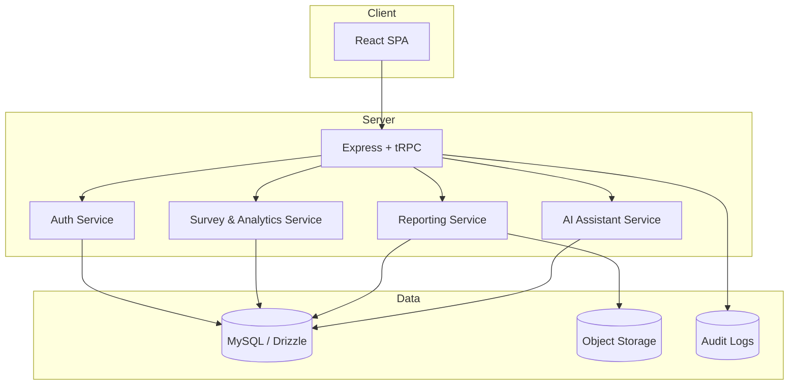

# Architecture Diagram

```mermaid
flowchart TB
    subgraph Client
      A[React SPA]
    end

    subgraph Server
      B[Express + tRPC]
      C[Auth Service]
      D[Survey & Analytics Service]
      E[Reporting Service]
      F[AI Assistant Service]
    end

    subgraph Data
      G[(MySQL / Drizzle)]
      H[(Object Storage)]
      I[(Audit Logs)]
    end

    A --> B
    B --> C
    B --> D
    B --> E
    B --> F
    C --> G
    D --> G
    E --> G
    E --> H
    F --> G
    B --> I
```
