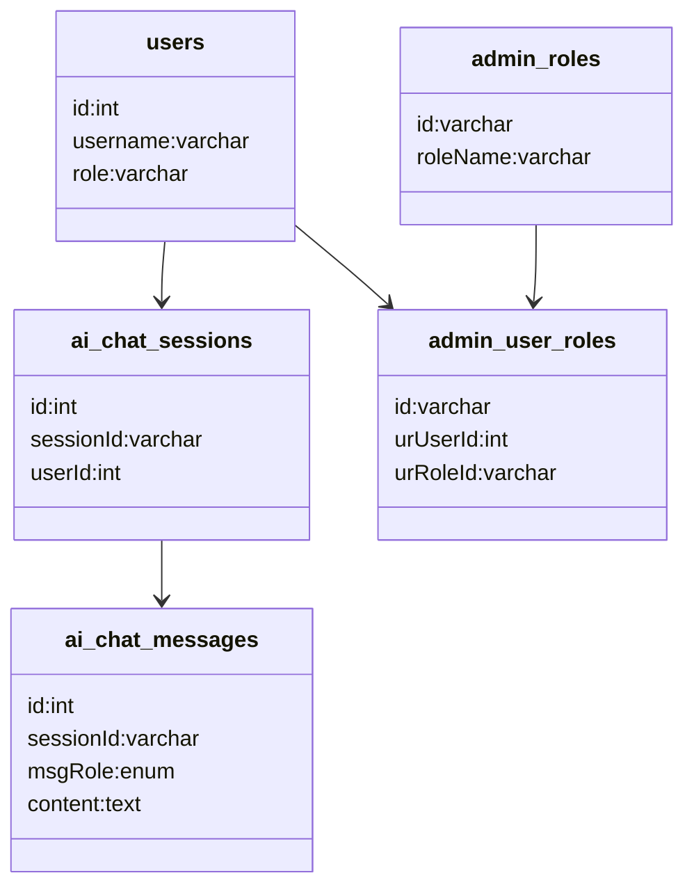

# Database Schema

## الجداول الأساسية (منطقياً)
- `users`: بيانات المستخدمين والأدوار.
- `activity_logs`: سجل العمليات.
- `admin_*`: جداول الإدارة والصلاحيات.
- `ai_chat_sessions` و`ai_chat_messages`: جلسات ورسائل المساعد الذكي.

## علاقات رئيسية
- المستخدم يمتلك جلسات AI متعددة.
- كل جلسة AI تحتوي رسائل متعددة.
- المستخدم يمكن أن يرتبط بعدة أدوار عبر جدول وسيط.

## مخطط مبسط

