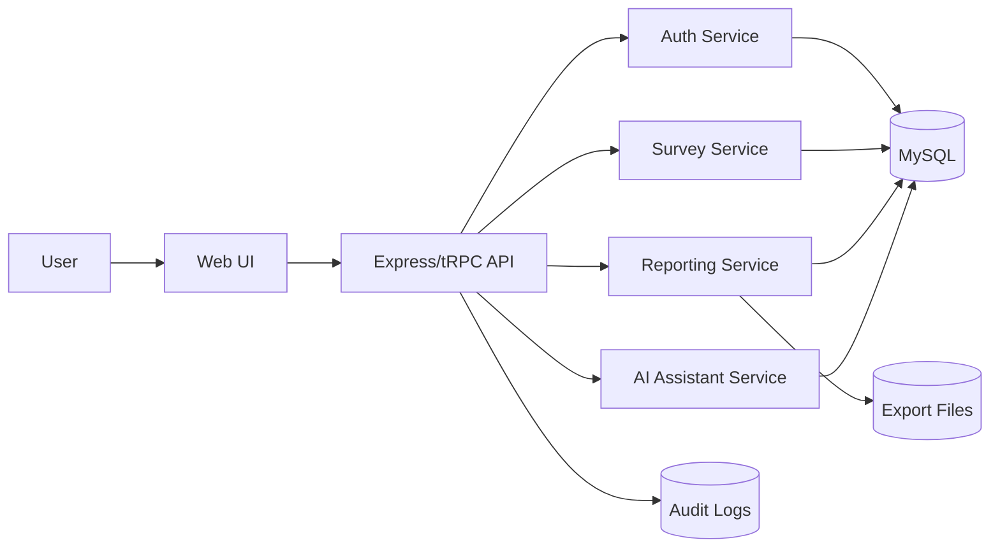

# DFD - Data Flow Diagram

```mermaid
flowchart LR
    U[User] --> UI[Web UI]
    UI --> API[Express/tRPC API]
    API --> AUTH[Auth Service]
    API --> SURVEY[Survey Service]
    API --> REPORT[Reporting Service]
    API --> AI[AI Assistant Service]
    AUTH --> DB[(MySQL)]
    SURVEY --> DB
    REPORT --> DB
    AI --> DB
    REPORT --> FILES[(Export Files)]
    API --> LOGS[(Audit Logs)]
```
