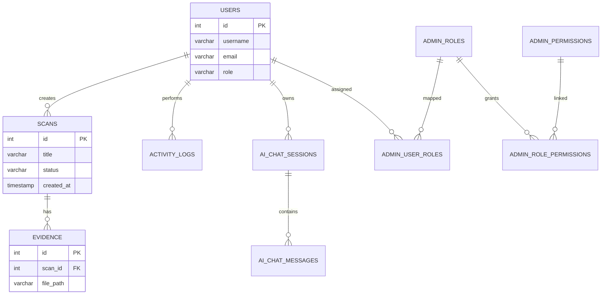

# ERD - Entity Relationship Diagram

```mermaid
erDiagram
    USERS ||--o{ SCANS : creates
    USERS ||--o{ ACTIVITY_LOGS : performs
    USERS ||--o{ AI_CHAT_SESSIONS : owns
    AI_CHAT_SESSIONS ||--o{ AI_CHAT_MESSAGES : contains
    USERS ||--o{ ADMIN_USER_ROLES : assigned
    ADMIN_ROLES ||--o{ ADMIN_USER_ROLES : mapped
    ADMIN_ROLES ||--o{ ADMIN_ROLE_PERMISSIONS : grants
    ADMIN_PERMISSIONS ||--o{ ADMIN_ROLE_PERMISSIONS : linked
    SCANS ||--o{ EVIDENCE : has

    USERS {
      int id PK
      varchar username
      varchar email
      varchar role
    }
    SCANS {
      int id PK
      varchar title
      varchar status
      timestamp created_at
    }
    EVIDENCE {
      int id PK
      int scan_id FK
      varchar file_path
    }
```

> ملاحظة: `SCANS` و`EVIDENCE` تمثلان نموذج الأعمال التشغيلي حتى لو كان التنفيذ الفعلي موزعاً على جداول متعددة.
