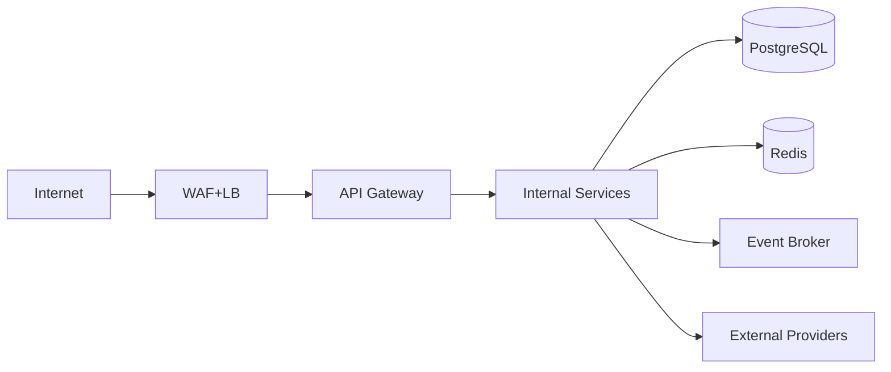
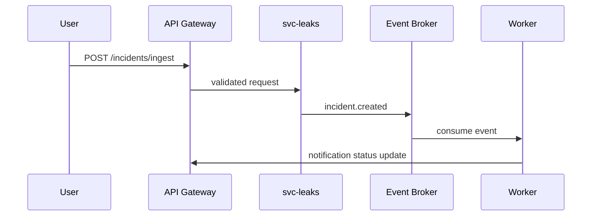
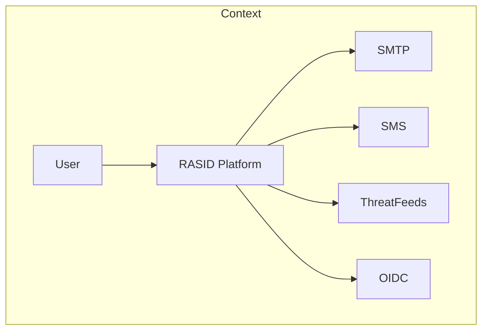
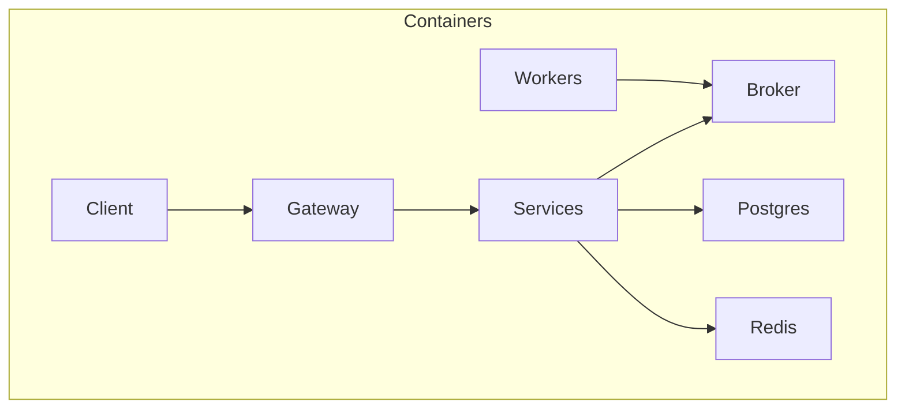
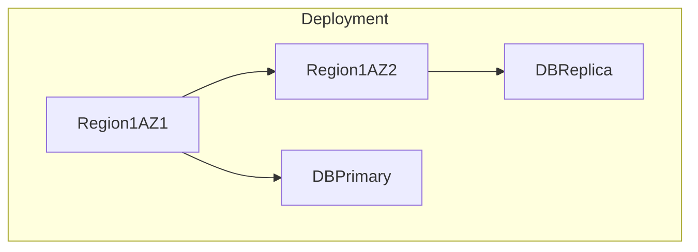

# SEC-ARCH

## Logical Components

| Component | Responsibility |
|---|---|
| web-client | UI rendering, token handling, request orchestration |
| api-gateway | AuthN/AuthZ enforcement, request routing, idempotency middleware |
| svc-auth | credential verification, token issuance, session revocation |
| svc-leaks | leak ingestion, incident triage lifecycle |
| svc-privacy | assessment and DSAR lifecycle |
| svc-ai | tool routing and response composition |
| worker-jobs | async notification/export/collection tasks |
| event-broker | topic-based event distribution |
| postgres | canonical relational persistence |
| redis | cache, rate limiting counters, distributed locks |

## Deployment Architecture

| Layer | Nodes |
|---|---|
| Edge | regional load balancer |
| App | k8s cluster multi-AZ pods for gateway/services/workers |
| Data | managed PostgreSQL primary + replica, Redis primary + replica |
| Observability | Prometheus, Loki, Tempo, Alertmanager |

## Trust Boundary Rules

| Boundary | Rule |
|---|---|
| TB-001 | Only API gateway SHALL accept internet ingress. |
| TB-002 | Service-to-service traffic MUST use mTLS. |
| TB-003 | Data stores SHALL reject non-private network traffic. |

## Inter-Component Data Flows

## Failure Isolation and Resilience Policies

| Policy | Deterministic Rule |
|---|---|
| Blast Radius | Service failure SHALL NOT block unrelated workspace endpoints. |
| Retry | 3 attempts exponential backoff with jitter 20%. |
| Circuit Breaker | open after 50% failures over 20 requests; half-open after 30s. |
| Bulkhead | worker pools SHALL be isolated by domain: leaks/privacy/ai. |
| Backpressure | gateway SHALL return 429 when queue depth exceeds threshold in SEC-PERF-004. |

## Transaction Boundaries

| Boundary ID | Scope |
|---|---|
| TX-001 | Auth login: session row + audit event in single DB transaction |
| TX-002 | Incident creation: incident + first state transition + audit event |
| TX-003 | Assessment save: assessment header + control rows |

## Consistency and Replication

| Data Type | Consistency | Replication |
|---|---|---|
| auth/session | strong | sync to primary only, async read replicas |
| incidents | strong writes, eventual read models | async event projection |
| analytics | eventual | stream-based materialization |

## Architecture Diagrams

