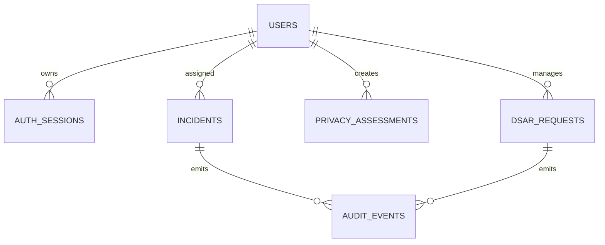

# SEC-DATA

## Entity Catalog

| Entity | Purpose |
|---|---|
| users | identity and role mapping |
| auth_sessions | token/session lifecycle |
| incidents | leak incident core record |
| privacy_assessments | privacy scoring record |
| dsar_requests | data subject rights requests |
| audit_events | immutable audit trail |

## Canonical Schemas

### users JSON Schema
```json
{"type":"object","required":["id","email","role","status"],"properties":{"id":{"type":"string"},"email":{"type":"string","format":"email"},"role":{"type":"string"},"status":{"enum":["active","disabled"]}}}
```
### users SQL DDL
```sql
CREATE TABLE users (
  id UUID PRIMARY KEY,
  email TEXT NOT NULL UNIQUE,
  password_hash TEXT NOT NULL,
  role TEXT NOT NULL,
  status TEXT NOT NULL CHECK (status IN ('active','disabled')),
  created_at TIMESTAMPTZ NOT NULL,
  updated_at TIMESTAMPTZ NOT NULL
);
```

### incidents JSON Schema
```json
{"type":"object","required":["id","source_id","severity","state"],"properties":{"id":{"type":"string"},"source_id":{"type":"string"},"severity":{"enum":["low","medium","high","critical"]},"state":{"enum":["NEW","TRIAGED","CONTAINED","CLOSED"]}}}
```
### incidents SQL DDL
```sql
CREATE TABLE incidents (
  id UUID PRIMARY KEY,
  source_id TEXT NOT NULL,
  external_id TEXT NOT NULL,
  payload_hash TEXT NOT NULL,
  severity TEXT NOT NULL,
  state TEXT NOT NULL,
  owner_user_id UUID NULL REFERENCES users(id),
  version INT NOT NULL DEFAULT 1,
  created_at TIMESTAMPTZ NOT NULL,
  updated_at TIMESTAMPTZ NOT NULL,
  UNIQUE(source_id, external_id, payload_hash)
);
```

## Constraints

| Constraint Type | Rule |
|---|---|
| Uniqueness | users.email and incidents(source_id,external_id,payload_hash) SHALL be unique. |
| Nullability | all `created_at` and `updated_at` columns SHALL be NOT NULL. |
| Range | privacy control score SHALL be 0..100 inclusive. |
| Referential Integrity | incident owner_user_id SHALL reference existing users.id. |

## Index Strategy

| Table | Index | Purpose |
|---|---|---|
| users | idx_users_role | role filters |
| incidents | idx_incidents_state_severity | triage queue |
| dsar_requests | idx_dsar_due_at_state | SLA monitoring |
| audit_events | idx_audit_actor_time | forensic retrieval |

## Partition/Sharding Strategy

| Dataset | Strategy |
|---|---|
| audit_events | monthly time partition by event_at |
| incidents | no shard <= 50M rows; hash shard by id when exceeded |

## Retention and Archival

| Entity | Retention | Archive Rule |
|---|---|---|
| auth_sessions | 90 days | hard delete after expiry+90d |
| incidents | 7 years | archive to object store after closure+1y |
| dsar_requests | 5 years | archive immutable package after fulfillment |
| audit_events | 7 years | WORM archive after 13 months hot storage |

## Deletion Rules

| Entity | Mode | Timeline |
|---|---|---|
| users | soft delete status=disabled | immediate |
| sessions | hard delete | scheduled daily |
| dsar packages | hard delete on legal expiry | +5 years |

## Data Lineage and Provenance Rules

| Rule ID | Rule |
|---|---|
| LIN-001 | Each derived analytics row SHALL include source_event_id. |
| LIN-002 | AI responses SHALL include citation metadata and source timestamps. |

## Migration Rules

| Rule ID | Rule |
|---|---|
| MIG-001 | Forward migrations SHALL be additive before destructive changes. |
| MIG-002 | Backward compatibility SHALL support previous API minor version for 90 days. |
| MIG-003 | Rollback SHALL NOT execute destructive down migration without snapshot restore point. |

## ERD


